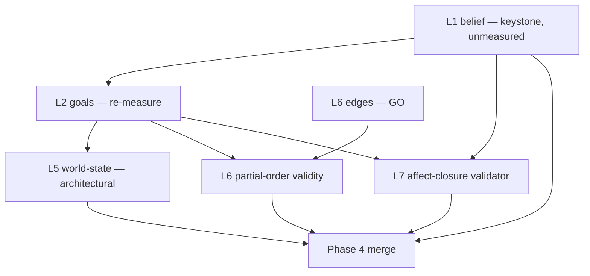

# Plan: Next Phase — Re-level the Deep Lanes

**Date:** 2026-06-27
**Status:** Proposed. Supersedes the forward half of
[plan-implementation-phases.md](plan-implementation-phases.md) (Phases 3–4) in light of the L1–L7
results.
**Companions:** [status-L1-L7.md](status-L1-L7.md) (verdicts and numbers),
[reflections-L1-L6.md](reflections-L1-L6.md) (why the framing changed),
[`../../dungeon_master/docs/research-results-modeling-plot.md`](../../dungeon_master/docs/research-results-modeling-plot.md)
(the lane model and the authoring-consistency checks this plan adopts).

---

## Why a new phase, not a continuation

The original plan treated all seven layers as one kind of task — recognise a typed structure from a
synopsis, gate each on recall against an authored gold. The L1–L7 results showed that is two kinds of
task wearing one uniform:

- **Surface lanes** (L3 beats, L4 kinds, L6 causal *edges*) — the target is *on the page*.
  Recognition is legitimate; recall gates are honest; these passed and stay as they are.
- **Deep lanes** (L1 belief, L2 goals, L5 world-state, L7 affect) — the target was *authored off the
  page*. Recognising it reverses a lossy projection. A recall gate against the authored gold measures
  how *guessable* the authoring was — low by design — and reports it as capability. That is the
  theatre the L7 arc exposed.

So this phase does three things the old plan could not: it **re-levels the deep lanes onto the right
kind of gate**, it **sequences by dependency** (belief and goals are upstream of affect; foundation
before roof), and it **retires L7 as a detector** while keeping it as a validator.

---

## Guiding principles (additions to the original five)

6. **Recognise the surface, author/compute the deep.** Recall-gate only the lanes whose target is in
   the prose. For deep lanes, the output is a *draft for human confirmation* or a *computation from
   upstream lanes* — never a number graded against the authored gold as if it were capability.
7. **Input-adequacy pre-gate.** Before authoring any recall gate, grep the source for the target
   signal. ~0 occurrences means the construct is ill-posed at the input — fix the input or drop the
   layer before measuring the model. (The L7 lesson: *check the input carries the signal before
   scoring for it.*)
8. **Validators, not recall, gate the deep lanes.** Adopt the research's authoring-consistency checks
   (RQ5) as the real gates: plan-exists, monotonic lifecycle, affect closure, capped reachability,
   belief grounding. These are deterministic and measure *coherence*, which is what a bootstrapped
   draft must satisfy.
9. **Sequence by dependency, not by layer number.** A layer that consumes another's output waits for
   that output to be *correct*, not merely to *exist*.

---

## Dependency order

The critical path runs **belief → goals → {world-state, causal-topology} → merge.** Affect is no
longer on the path; it re-enters only as a validator the merge node may run.

---

## Steps

### N1 — Re-measure L2 (goals) — *cheapest high-value action, do first*

**Goal:** Run the FR-581 re-spike already authorised and record a verdict.
**Why first:** It is the one REVISE with a built-but-unrun revision, and it gates L5, L6-topology,
and any affect computation. Until L2 is known, every downstream estimate is on sand.
**Deliverable:** L2 re-spike result; verdict GO (≥ 0.80) or escalate.
**Gate:** goal recall ≥ 0.80 → GO. 0.50–0.80 → this is a *deep lane*; stop prompt-tuning and convert
to draft-and-confirm (principle 6) rather than a third revise.
**Risk:** Low to run. The honest risk is discovering goals are only ~0.75-recoverable — which is not
a failure but the signal to re-level the gate.

### N2 — Measure L1 (belief) — *the unmeasured keystone*

**Goal:** Give the highest-leverage lane in the whole design its first number, and decide its gate
*shape* before its threshold.
**Why:** Belief is the research's #1 lane; everything epistemic (secrets, reveals, irony) and every
relational emotion (guilt, betrayal) depends on it. It is currently the only layer with no
measurement.
**Deliverables:** an L1 belief spike (extract `believes(observer, fluent, t)` from the synopses);
an input-adequacy check first (principle 7 — does the synopsis even state who believes what?).
**Gate:** *Not a bare recall gate.* Belief is a deep lane. Report recall for information, but gate on
**belief grounding** (every `mistaken(obs, p)` resolved by a later reveal; no reveal without a prior
mistaken belief) — a consistency check, not a guess-the-author score.
**Risk:** Medium-high. The likely finding is that synopses under-state belief (the floodmark
"presumed dead" is a belief delta the prose rarely spells out). If so, belief is **authored, not
extracted** — which is itself the deliverable, and redirects to draft-and-confirm.

### N3 — L5 (world-state) architectural FR — *the prompt-only path is closed*

**Goal:** Replace the single free-text predicate-invention call with a two-step structure.
**Why:** FR-582 fired the stop rule (0.55 flat, Sonnet regressed). The gap is structural — one call
inventing four interacting slices over an open vocabulary under-determines its own labels.
**Deliverables:**
- Step A — enumerate the state variables in play (closed predicate set, named entities only).
- Step B — assign values from a *closed selection set* per variable (kills free-text label drift).
- A deterministic **move-decomposition** post-pass emitting the `at(X)=false` departure for every
  arrival (the single largest miss cluster — 100% dropped today).
**Gate:** combined world recall ≥ 0.70 *with* the per-genre move-heavy genres no longer floor-bound;
OR, if still short, re-level to consistency-gated draft-and-confirm (principle 6/8).
**Risk:** Medium. Two-step adds orchestration; the win is removing invention from the LLM's job.

### N4 — L6 partial-order validity — *close the global half*

**Goal:** Validate the *assembled* causal graph, not just per-edge `enables` recall.
**Why:** L6 edges are GO (0.96), but the affect arc caught the derived goal topology pointing
backwards (`expose_ARIA enables trace_anomaly`) and binding antagonist goals as protagonist
prerequisites. The research's value in this lane is the **partial order** (parallel-safety,
plan-exists), not the individual edge.
**Deliverables:** a `derive_goal_graph` validator — forward-only by beat order; no antagonist goal as
`enabled_by` a protagonist goal; the graph is a DAG; **plan-exists** (a topological order satisfies
every function's preconditions from the initial state).
**Gate:** the assembled graph passes the validator on all 5 fixtures.
**Risk:** Low-medium. Deterministic check; the risk is discovering the topology is frequently invalid,
which would feed back into L2/L6 prompt or schema work.

### N5 — Retire L7 as detector, keep it as validator

**Goal:** Remove the L7 recall gate from the pipeline and install **affect closure** as a
deterministic validator.
**Why:** L7 detection is REFUTED — the input carries no affect (0/13 emotion words). But "every
opened affect unit must terminate before THE END" is a valid, cheap, deterministic check over
*authored* deltas — the research's own gate for the lane.
**Deliverables:**
- Delete/relax the L7 recall gate; archive the eleven affect-detection prompt variants (keep the
  FR-605 frozen-gate baseline for the record).
- An `affect_closure` validator over the authored `eff_affect` deltas.
- *Optional, deferred:* compute affect as `sign(Δ goal_congruence)` per beat from validated L2/L6
  transitions — a projection, not a detection. Gate this on goal-tracking, not emotion recall.
  **Blocked on N1 and N4.**
**Gate:** the validator runs in the merge node; no recall gate remains on affect.
**Risk:** Low. This is mostly deletion plus one deterministic check.

### N6 — Phase 4 merge under the new regime

**Goal:** Run L1→L2→L3→L4→L5→L6→merge end-to-end and validate the assembled plan with the
authoring-consistency suite, not per-layer recall.
**Why:** Merge was always the bottleneck; it is now unblocked once N1 (L2), N2 (L1), and N3 (L5)
land, with N4 and N5 supplying the validators.
**Deliverables:** the merge node (deterministic join by function id); the validator suite wired as the
gate (plan-exists, monotonic lifecycle, affect closure, capped reachability, belief grounding).
**Gate:** the full pipeline produces a plan that passes the validator suite for ≥ 4 of 5 synopses —
*coherence*, not recall, is the success criterion.
**Risk:** Medium (composition), low per-part — the layers are proven by this point.

---

## Phase summary

| Step | What | Depends on | Gate kind | Risk |
|------|------|-----------|-----------|------|
| **N1** | Re-measure L2 goals | — | recall, then re-level | low |
| **N2** | Measure L1 belief | — | grounding (consistency) | med-high |
| **N3** | L5 world-state architectural | N1 | recall, then re-level | medium |
| **N4** | L6 partial-order validity | N1, L6-edges | validator (deterministic) | low-med |
| **N5** | L7 detector → validator | — | validator (deterministic) | low |
| **N6** | Phase 4 merge | N1–N5 | validator suite (coherence) | medium |

## Definition of done for the phase

1. L1 belief has a number and a *grounding* gate (not a bare recall gate).
2. L2 goals is either GO ≥ 0.80 or explicitly re-levelled to draft-and-confirm.
3. L5 world-state is either GO ≥ 0.70 via the two-step architecture or re-levelled.
4. The assembled causal/goal topology passes a deterministic plan-exists validator.
5. The L7 recall gate is gone; affect closure runs as a validator; the prompt graveyard is archived.
6. The merge node produces a plan gated on **coherence (the validator suite)**, and the README/plan
   contract documents that deep lanes are *bootstrapped drafts*, not recognised facts.

## What this phase deliberately does **not** do

- It does not chase L7 affect detection further. That lever is spent.
- It does not add prompt complexity to the deep lanes. Principle 6 forbids it; complexity there was
  the symptom, not the cure.
- It does not gate belief, goals, world, or affect on recall against the authored gold as if that
  number were capability. The authored gold is the *target to draft toward*, not the *answer key*.
