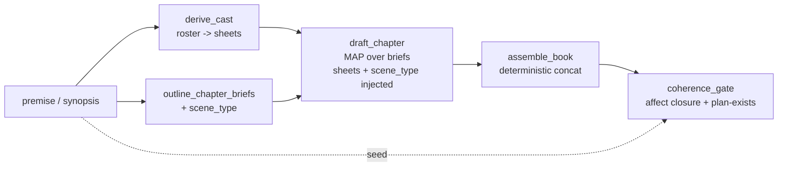

# Plan: The Round-Trip Walking Skeleton — Characters + Chapter Briefs

**Date:** 2026-06-27
**Status:** Proposed (buildable). Concrete instantiation of
[plan-generative-roundtrip.md](plan-generative-roundtrip.md) (the architecture) using the
walking-skeleton method. **Carries** the scene-typing work from
[plan-scene-typing.md](plan-scene-typing.md): `scene_type` is **authored into the chapter brief**, not
classified back out of prose.

---

## Why a walking skeleton

The L1–L7 effort was **bottom-up** — perfect each layer in isolation, grade it on recall. L7 has been
AMBER-RED for weeks *because it was graded alone*. A walking skeleton inverts this: build the thinnest
loop that runs **all the way through** (premise → characters + chapter briefs → prose → assemble →
coherence gate), accept whatever each thin node currently produces, then **thicken the one stage the
end-to-end output shows is dropping signal.** This is what the architecture doc already calls
self-diagnosing — the skeleton *is* the instrument that says which lane to fix next.

The decisive payoff: **`scene_type` becomes an authored field, not a recognition problem.** A chapter
brief is an artifact we write; we declare `scene_type` on it and project it into prose. No L4b
classifier is on the critical path — classification is deferred to the extraction/comparison side,
where it only matters for checking preservation.

---

## Reuse map — what each existing sample contributes

The skeleton is mostly **wiring proven nodes**, with one new typed object (the brief carrying
scene_type) and one new validator. Nothing here is greenfield.

| Skeleton stage | Reuse verbatim-ish from | Concrete asset |
|---|---|---|
| Spine shape (synopsis → units → map-prose → review), pure `graph run`, no runner | `demos/novel_generator` | [`graph.yaml`](../../demos/novel_generator/graph.yaml) (~130 lines, map node + gates) |
| Characters (names → cards) | `dungeon_master` roster→card; `plot_modeller` interiority | [`character_roster.yaml`](../../dungeon_master/prompts/character_roster.yaml), [`character.yaml`](../../dungeon_master/prompts/character.yaml), `interiority_ab` `derive_cast`/`author_interiority` |
| **Chapter briefs** (the load-bearing object) | `dungeon_master` chapter outline | [`chapter_outline.yaml`](../../dungeon_master/prompts/chapter_outline.yaml) |
| Per-beat / per-chapter prose (map fan-out) | `demos/novel_generator` `generate_prose` map | [`prose/generate_beat.yaml`](../../demos/novel_generator/prompts/prose/generate_beat.yaml) |
| Deterministic assembly (no whole-book LLM) | `dungeon_master` Book compose (FR-492) | `nodes/`/`tools/` concat tool |
| Coherence gate (affect closure etc.) | `plot_modeller` validators | new tool, this plan |

**The chapter brief is already 90% built.** `dungeon_master`'s `chapter_outline` emits, per chapter:
`{title, summary, beats[3–6], cast[names], entry_state, exit_state}`. That is the brief. The walking
skeleton adds exactly one field — `scene_type` — and (optionally) `mode`. Everything else (the
entry/exit-state hand-off contract, the cast roster, the beat checklist) we inherit intact.

---

## The two new typed objects

### Character sheet (the "who")

Reuse the `plot_modeller` interiority sheet (already A/B-validated as conditionally GO): per principal,
`{name, goal, belief, affect_arc}`. Cast list comes from the `character_roster` prompt (2–4 principals).

### Chapter brief (the "what + how")

`chapter_outline`'s object, **plus scene_type**:

```yaml
chapter_id: 3
title: "Chapter 3 — The Drive in Her Bag"
summary: <one paragraph: what happens, where it leaves off>
cast: [Mara, Jonas]            # focal principals (inherited)
beats: [...]                   # 3-6 ordered key events; kind=Propp = WHAT (orthogonal)
entry_state: <config true as it opens>   # inherited hand-off contract
exit_state:  <config true as it closes>  # inherited hand-off contract
scene_type: reactive           # ← NEW: proactive | reactive (authored, not classified)
mode: dialogue                 # ← NEW optional: action|dialogue|feeling|thought|...
```

`scene_type` drives the affect dose in the draft node (proactive=low interior, reactive=high) — the
writer side of [plan-scene-typing.md](plan-scene-typing.md).

---

## Skeleton topology (one graph, all `yamlgraph graph run`)



Nodes (thin first, thicken later):
1. `derive_cast` (llm) — synopsis → 2–4 principals → interiority sheets. *Reuse roster + author_interiority.*
2. `outline_chapter_briefs` (llm) — synopsis → ordered briefs. *Reuse `chapter_outline`; add `scene_type` to its schema + one rule in the prompt: "classify each chapter proactive (goal→conflict→disaster, feeling spent in action) or reactive (reaction→dilemma→decision, feeling resolved internally)."*
3. `draft_chapter` (map over briefs) — brief + cast sheets + `scene_type` dose → prose. *Reuse `generate_beat` map; inject the sheets and the scene_type affect-dose clause.*
4. `assemble_book` (python tool) — ordered concat, **no LLM**. *Reuse the FR-492 deterministic compose pattern.*
5. `coherence_gate` (python tool) — the round-trip validators (start with **affect closure**, scene_type-aware), emits a number.

Edges are linear except the map fan-out/fan-in. `graph lint` passing is the smoke test (DoD #6 of the
architecture doc).

---

## Sequencing — skeleton first, then thicken the indicted lane

1. **Stand up the linear skeleton** with thin nodes, one genre (reuse the Loom synopsis fixture). It
   must produce (a) an assembled story and (b) one coherence number from the first run — *skeleton
   without a gate is a demo; skeleton with a gate is a test harness.*
2. **First thickening = the L7 close-op widening** ([plan-scene-typing.md](plan-scene-typing.md) cheap
   first move): baseline the **dangling-open rate**, add the `reactive` close branch gated on the
   brief's `scene_type`, re-measure. The skeleton gives this a number to move *in context*, not in
   isolation — the whole reason L7-alone stalled.
3. **Read the gate to localise the next lossy lane** and thicken it; re-run. Repeat.
4. **Defer the L4b `scene_type` classifier** to the comparison side only (extract scene_type back out
   of the generated prose to check it was preserved) — never on the generative critical path.

---

## What this changes vs the architecture doc

- The architecture doc's "stand up the skeleton loop first" (Sequencing step 1) is **made concrete
  here** as characters + chapter briefs, with named reuse.
- `scene_type` moves from *recognised* (an L4b classifier, a blocker) to *authored* (a brief field, free)
  — aligning with the doc's own author-and-project thesis.
- The first lane the skeleton thickens is **L7 affect closure**, because the close-op proactive-only
  bug is already located and has a ready metric (dangling-open rate).

---

## Definition of done (skeleton)

1. One genre runs end-to-end via `yamlgraph graph run graphs/roundtrip_skeleton.yaml --var ...`: premise
   → cast sheets + chapter briefs → drafted chapters → assembled story → coherence gate.
2. Chapter briefs carry `scene_type` as an **authored** field; the draft node doses interior by it.
3. Assembly is a deterministic no-LLM tool; the only Python is leaf tools (architecture DoD #6).
4. The coherence gate emits at least the **affect-closure** number (scene_type-aware), so each later
   thickening has a metric to move.
5. `graph lint` passes as the smoke test.
6. No `spike_*.py` runner sequences the loop.

---

## Open questions

- **Brief granularity:** one prose draft per *chapter* (coarse, cheap) or per *beat* within a chapter
  (finer, the architecture doc's L8-per-beat option)? Start per-chapter; split to per-beat only if the
  gate shows chapter-level drafting loses beats.
- **scene_type at chapter vs beat level:** a chapter may mix a proactive climax with a reactive
  aftermath. Start with one `scene_type` per chapter (cheapest); if the gate shows mixed chapters
  mis-dosed, push the tag down to the beat.
- **Cast sheet source:** `dungeon_master` `character` card vs `plot_modeller` interiority sheet — the
  latter is A/B-validated for affect arc and is the better fit; confirm its fields suffice for drafting.
