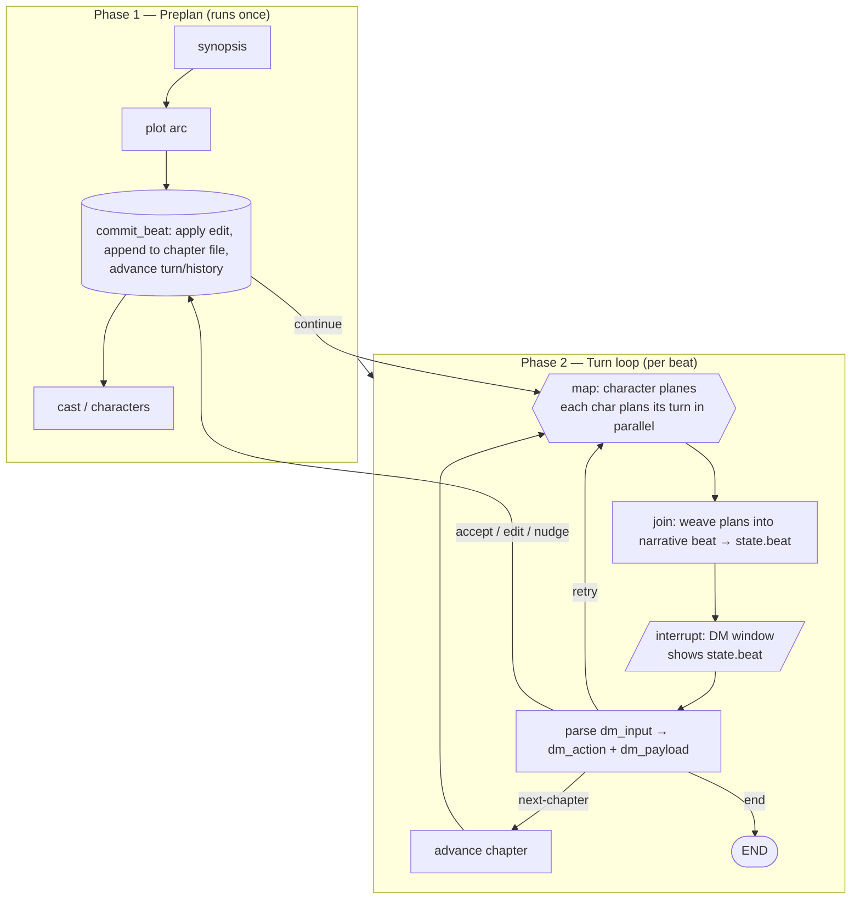

# Feature Request: FR-466 Turn-Based Book / Dungeon Master Example

**Priority:** MEDIUM
**Type:** Feature
**Status:** Judged — Approved (scope frozen 2026-06-06)
**Effort:** Phased (4 phases)
**Requested:** 2026-06-06

## Summary

A YAMLGraph example (`examples/dungeon-master/`) that fuses the **eBook** preplanning spine with the **NPC encounter** turn loop, adding a Dungeon Master (DM) steering window so a human can adjust an unfolding story turn by turn. Characters plan their moves in parallel "planes," a join node weaves those plans into one narrative beat, and a DM interrupt at the end of every turn defaults to accept/edit.

## Value Statement

Story authors and YAMLGraph learners get a runnable, steerable, multi-agent narrative engine that demonstrates `map` fan-out, file-based preplanning, and turn-level human-in-the-loop control in one cohesive example.

## Problem

The existing examples each demonstrate half of the desired pattern:

- `examples/ebook/` shows **preplanned, structured-before-generated** content via a linear pipeline writing to files, but is fully autonomous — no human steering, no parallel agency.
- `examples/npc/` shows a **checkpointed turn loop** with `interrupt` (DM input) and `map` (parallel NPCs), but has no preplanned long-form structure (synopsis → plot → chapters) and the DM only *describes events* rather than *steering/editing the produced narrative*.

There is no example that (a) preplans a full story skeleton, (b) lets characters act in parallel planes each turn, (c) weaves those into a coherent beat, and (d) gives the user turn-level accept/edit/nudge control over the result.

## Proposed Solution

Two graphs mirroring NPC's split, with a three-window mental model.



**Commit happens *after* the DM decision (F1/F2):** `weave` writes only to `state.beat`; the file is written and `turn_number`/`history` advance in `commit_beat`, reached only on accept/edit/nudge/next-chapter. Retry re-rolls the same turn with no commit and no counter change.

### `preplan.yaml`

```
START → synopsis → plot → chapters → cast → END
```

Linear, like `npc-creation.yaml`. Writes `story.json` + per-chapter outline files (eBook file-based pattern).

### `turn-loop.yaml`

| Node | Type | Role |
|---|---|---|
| `plan_all` | `map` over `{state.cast}`, `as: char`, `collect: turn_plans` | Each character privately plans its move, conditioned on chapter goal + recent history + active steering var. Each plan is **tagged with the character name** so `weave` attributes by identity, not list position (F5). **Separate planes.** |
| `weave` | `llm` | Joins `turn_plans` into one narrative passage written to `state.beat` only. **The middle.** |
| `dm_window` | `interrupt`, `resume_key: dm_input` | Shows `state.beat`; DM steers every turn. **The end window.** |
| `parse_dm` | `passthrough` | Splits `dm_input` into `dm_action` + `dm_payload` (DM grammar below). |
| `commit_beat` | `python` tool | Applies edit (`beat = dm_payload` when action is edit), appends final beat to the current chapter file, advances `turn_number` and `history`. Reached only on accept/edit/nudge/next-chapter (F1/F2/F4). |

### DM Control Model (turn-level, default accept/edit)

The DM input is parsed into a structured action so Edit and Nudge are unambiguous (F3). CLI grammar:

| DM action | `dm_input` (CLI) | Commits? | Effect |
|---|---|---|---|
| **Accept** (default) | empty / `accept` | yes | Commit beat as-is, advance. Enter-through = autonomous run. |
| **Edit** | `edit: <text>` | yes | Replace `state.beat` with `<text>`, commit, advance (overrides *this* turn). |
| **Nudge** | `nudge: <text>` | yes | Commit current beat **and** set steering var from `<text>` for the next `plan_all` (steers *next* turn). |
| **Retry** | `retry` | no | Re-run `plan_all` + `weave` for the same turn; no commit, no counter change. |
| **Next chapter** | `next-chapter` | yes | Commit and advance `chapter_index`. |
| **End** | `end` | — | Stop the run. |

The steering var set by Nudge is **consumed and cleared** at the start of the next `plan_all`, so a nudge influences exactly one subsequent turn.

### State

```yaml
state:
  premise: str
  synopsis: dict
  plot: dict
  chapters: list
  cast: list
  chapter_index: int
  turn_number: int
  turn_plans: list        # collected from map (per-character plane); each tagged with char name
  beat: str               # joined narrative this turn (pre-commit, editable)
  history: list
  dm_input: str           # raw DM input (CLI grammar)
  dm_action: str          # parsed: accept | edit | nudge | retry | next-chapter | end
  dm_payload: str         # parsed edit/nudge text
  steer: str              # active nudge for next plan_all; cleared after consumption
```

## Phased Implementation

Each phase is independently demonstrable and lands as its own PR with a witness test and demo output. A new capability `CAP-164-dungeon-master-example.yaml` carries the requirement IDs (`REQ-YG-429`..`REQ-YG-434`), created in Phase 1.

### Phase 1 — Preplanning spine (`preplan.yaml`)
**Goal:** Produce a structured story skeleton from a one-line premise.
- Prompts: `synopsis.yaml`, `plot.yaml`, `chapters.yaml`, `cast.yaml` (Jinja2 + inline Pydantic schemas).
- `preplan.yaml`: linear `synopsis → plot → chapters → cast`.
- File output: `story.json` + per-chapter outline files (reuse eBook file pattern).
- **REQ-YG-429** preplan graph compiles and runs from a premise var.
- **REQ-YG-430** preplan emits valid `story.json` with synopsis, plot, chapters, cast.
- **Demo:** `yamlgraph graph run examples/dungeon-master/preplan.yaml --var premise="..." --full` → `demo-output.log`.
- **Acceptance:** lint passes; witness test asserts structured output shape.

### Phase 2 — Parallel character planes + weave (single turn)
**Goal:** One turn: characters plan in parallel, join into a beat. No DM yet.
- Prompts: `character_plan.yaml` (output tagged with character name), `weave.yaml`.
- `plan_all` (`map`, `collect: turn_plans`) → `weave` (`llm`, writes `state.beat`).
- **REQ-YG-431** `map` fans out one branch per cast member; `turn_plans` length == cast length and each plan carries its character name.
- **REQ-YG-432** `weave` produces a non-empty beat attributing the planned actions by character name (order-independent, F5).
- **Demo:** run a single turn over a fixed `story.json`, capture beat in `demo-output.log`.
- **Acceptance:** witness test with mock LLM asserts fan-out count, per-plan attribution, and weave output.

### Phase 3 — Turn loop + DM interrupt (accept/edit/nudge/retry)
**Goal:** Wire the checkpointed loop with the turn-level DM window.
- Add `dm_window` (`interrupt`), `parse_dm` (`passthrough` grammar parser), `commit_beat` (python tool), checkpointer (SQLite `:memory:` dev).
- Commit-to-file and turn/history advance live in `commit_beat`, reached only on accept/edit/nudge/next-chapter (F1/F2/F4). Retry routes back to `plan_all` with no commit.
- Nudge sets `state.steer`; `plan_all` consumes and clears it each turn.
- `run.py` CLI runner (mirrors `run_encounter.py`): loop `invoke → interrupt → input → resume`, parsing the DM grammar.
- **REQ-YG-433** DM accept commits beat and advances; `edit:` overrides current beat; `nudge:` commits and steers exactly the next turn; `retry` re-rolls same turn without advancing the counter; `next-chapter` advances chapter; `end` terminates.
- **Demo:** scripted DM inputs (`accept`, `edit: ...`, `nudge: ...`, `retry`, `next-chapter`, `end`) → `demo-output.log`.
- **Acceptance:** witness test drives the loop via `Command(resume=...)` asserting each action's effect, including that retry does not increment `turn_number` and nudge clears after one turn.

### Phase 4 — Optional HTMX board UI
**Goal:** Three-zone web board over the same session adapter (parity with NPC `api/`).
- `EncounterSession`-style adapter; FastAPI routes `/start`, `/turn`.
- Layout: character-plane cards (top), editable woven beat (center), sticky DM bar (bottom: Accept default / edit / nudge / retry / next chapter / end).
- **REQ-YG-434** `/start` returns interrupt-paused state; `/turn` resumes with `dm_input` and renders the next beat.
- **Demo:** `uvicorn` boot + a scripted HTTP turn captured in `demo-output.log`.
- **Acceptance:** route test (TestClient) for start + one turn.
- **Note:** lowest priority; Phases 1–3 deliver the full CLI experience independently.

## Acceptance Criteria

- [x] Phase 1: `preplan.yaml` compiles, runs, emits valid `story.json` (REQ-YG-429, -430)
- [x] Phase 2: parallel `plan_all` + `weave` produce a beat for a single turn (REQ-YG-431, -432)
- [x] Phase 3: turn loop honors all six DM actions via interrupt/resume (REQ-YG-433)
- [ ] Phase 4 (optional): HTMX board start/turn (REQ-YG-434)
- [x] `CAP-164-dungeon-master-example.yaml` registers REQ-YG-429..434
- [x] Witness test per phase, tagged `@pytest.mark.req(...)`
- [x] `demo-output.log` committed per phase touching `examples/dungeon-master/`
- [x] `examples/dungeon-master/README.md` documents usage
- [x] Changelog fragment per phase in `changelog/unreleased/`
- [x] Diary reflection on completion

## Alternatives Considered

- **Single mega-graph** (preplan + loop in one file): rejected — preplan runs once and the loop is checkpointed/resumable; splitting mirrors the proven `npc-creation` + `encounter-loop` separation and keeps each file under the size budget.
- **Subgraph per character** instead of `map`: rejected — `map` already gives parallel fan-out/fan-in with `collect`, no per-character graph wiring needed.
- **DM as event narrator only** (NPC style): rejected — the request is for the DM to *adjust the produced narrative* (accept/edit), not merely inject events.
- **Between-chapter-only steering:** rejected per decision — turn-level control with accept default gives both low-friction autonomy and fine authority.

## Related

- `examples/ebook/` — file-based preplanning + write/judge/amend pattern
- `examples/npc/` — `interrupt` + `map` turn loop, session adapter, HTMX UI
- [FR-102](FR-102-ebook-pipeline-replan.md), [FR-103](FR-103-ebook-judge-amend-subgraph.md) — eBook lineage
- [docs/plan-dm.md](../docs/plan-dm.md) — design notes this FR formalizes
- `reference/graph-yaml.md` — `map`, `interrupt`, `passthrough` node specs

## Judgment (2026-06-06)

Judged against the node specs in `reference/graph-yaml.md`. **Approved with corrections folded in; scope frozen.**

Defects found and resolved:

- **F1 (blocker)** — Original loop wrote the beat to file before the DM could act, making Edit/Retry incoherent. Fixed: `weave` writes `state.beat` only; file commit moved to post-interrupt `commit_beat`.
- **F2 (blocker)** — Turn counter incremented pre-interrupt, double-counting on Retry. Fixed: advancement moved into `commit_beat`, reached only on committing actions.
- **F3 (ambiguity)** — Edit and Nudge were both indistinguishable free text. Fixed: explicit CLI grammar (`edit:`/`nudge:`/keywords) parsed by `parse_dm` into `dm_action` + `dm_payload`.
- **F4 (layer rule)** — `append_beat` typed as "python / passthrough" mixed a side effect with a state transform. Fixed: single python `commit_beat` tool owns the file write and returns the state update.
- **F5 (correctness)** — `map` collect order is non-deterministic (`operator.add` reducer). Fixed: `character_plan` output tagged with character name; `weave` attributes by identity.

Non-blocking: Nudge reclassified as a committing action (commit current beat + steer next); `state.steer` consumed and cleared each turn. CAP-164 / REQ-YG-429–434 confirmed collision-free.

**Authority granted** to implement Phases 1–3 (Phase 4 optional). Write the failing witness test first per phase; smallest sufficient change; no nodes beyond those enumerated above.

## Implementation Status (2026-06-06)

**Phases 1–3 complete.** Phase 4 (HTMX) deferred as optional per judgment.

Delivered:
- `examples/dungeon_master/` — `preplan.yaml`, `turn-loop.yaml`, six prompts, `nodes/story_io.py` (five Layer-3 tools: `save_story`, `load_story`, `prep_turn`, `parse_dm`, `commit_beat`), `run.py` CLI runner, `README.md`.
- `tests/unit/test_dungeon_master.py` — 18 witness tests, all green; REQ-YG-429..433 covered.
- `demo-output.log` (preplan) and `demo-turnloop.log` (full six-action DM loop terminating cleanly on `end`, 4 committed beats).

Decisions / deviations from the frozen plan:
- **Directory is `examples/dungeon_master/` (snake_case)**, not `dungeon-master`, for Python import compatibility (`module: examples.dungeon_master.nodes.story_io`). Plan/FR prose uses the hyphen form; the code is authoritative.
- **All LLM nodes use `parse_json: true`** instead of structured-output schemas. The only configured provider (Azure OpenAI) enforces STRICT structured output requiring `additionalProperties: false` on nested object arrays, which YAMLGraph's schema generation does not emit. `parse_json` returns a parsed dict from JSON text, bypassing strict mode and remaining provider-portable. Prompts keep `output_schema` as documentation plus an explicit "respond with ONLY a JSON object" instruction.
- **`draft_beat` / `beat` channel split.** The pre-DM woven draft writes `draft_beat`; `commit_beat` reads it and writes the committed `beat`. A single shared `beat` channel raised `InvalidUpdateError` (two writers across the interrupt resume).
- **Interrupt `message` uses Jinja2 (`{{ state.x }}`)**, not `str.format` `{state.x}` — control-node message formatting does not expose a flat `state` key.
- **Framework prerequisite — FR-467.** Phase 3 surfaced a latent framework defect: a conditional edge whose target is a `map` node (`parse_dm` retry → `plan_all`) registered a *second, unconditional* fan-out router, so the loop never terminated on `end`. Fixed under [FR-467](FR-467-conditional-edge-to-map-node.md) (conditional-to-map edges now route through the single expression router; a compile-time guard rejects dual-router nodes). Condemning tests: `tests/unit/test_interrupt_loop_termination.py`, `tests/unit/test_conditional_edge_to_map.py`. Reflection: `docs/diary/diary-2026-06-06-dual-router-fanout.md`.
