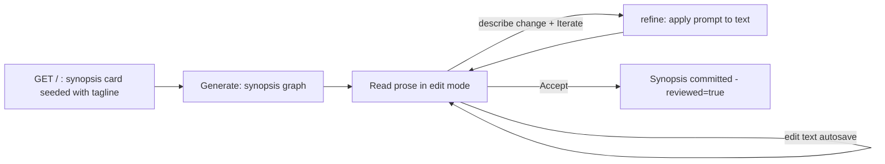

# FR-474: Dungeon Master v2 — Synopsis Prototype & App Skeleton

**Priority:** HIGH
**Type:** Prototype sketch (was: Feature)
**Status:** Built — GREEN prototype (2026-06-07); verdict: keep
**Effort:** ~half a day (prototype)
**Requested:** 2026-06-07
**Supersedes scope of:** FR-468/FR-470/FR-471/FR-472/FR-473 (all detached to `purgatory/`)

## Problem

The first DM prototype grew an over-scoped turn-loop/outline/beat system before its
core interaction was proven. It has been detached to
`examples/dungeon_master/purgatory/`. We restart with a single, honest goal and let
the structure that serves it become the skeleton for everything later.

> **First goal: interactive generation of the synopsis.**

The synopsis loop is simultaneously (a) the first *functional* component and (b) the
*bare-bones structure* — the swap-driven shell, the per-session document, the
self-contained generation graph — that the outline and beats will later hang off
without redesign.

## Goals

1. **Single-artifact loop.** Open the app → a synopsis card is already in front of
   the DM, seeded from a one-line tagline. Generate → read → edit-in-place →
   describe-a-change + Iterate → Accept.
2. **No splash screen.** The tagline is *inside* the synopsis card as editable seed
   text; there is no separate premise-setup page. (Drops `index.html`'s setup form.)
3. **Synopsis generation is its own graph.** A small, self-contained
   `synopsis.yaml` (tagline → synopsis) rather than the monolithic `preplan.yaml`.
   Testable in isolation; reusable as the first node of a larger story graph later.
4. **Skeleton, not scaffold-for-its-own-sake.** The file layout
   (`app → routes → session → story_doc` + graph + prompts + swap shell) is the
   minimal spine the whole app reuses. No node is added that the synopsis loop does
   not need.

## Non-Goals (deferred, must not leak in)

- Outline, chapters, beats, weaving, turn-loop play — stay in `purgatory/`.
- Asking for **character count** or **chapter count** up front — *"numbers of
  characters and chapters come later."*
- `cast`, `plot`, `chapters` prompts and `preplan.yaml`.
- The turn-loop checkpointer / `weave-beat.yaml`.

## Reuse from `purgatory/` (parts bin)

| Component | Action | Notes |
|---|---|---|
| `prompts/synopsis.yaml` | **Reuse** | Already rewritten to plain reveal-all (this session). |
| `prompts/refine.yaml` | **Reuse** | Generic "apply `<instruction>` to `<text>`" — engine behind Iterate. |
| `api/templates/components/text_block.html` | **Reuse as-is** | The iterable card macro (autosave + 3-line prompt + Iterate/Accept). |
| `api/templates/components/breadcrumb.html` | **Reuse as-is** | `#story-crumbs` spine across `#app-body` swaps. |
| `api/templates/components/synopsis_card.html` | **Reuse, trim copy** | Drop references to "begin browsing the outline" in Accept hint. |
| `api/templates/components/app_body.html` | **Reuse, reduce** | Keep only the `synopsis` mode branch; drop outline/chapter/beat includes. |
| `api/templates/components/error.html` | **Reuse as-is** | Error card. |
| `api/templates/base.html` | **Reuse, prune CSS later** | Theme + `.text-block`/`.iterate-prompt`/`.crumbs` styles. Beat/outline CSS pruned opportunistically, not eagerly. |
| `api/story_doc.py` | **Reuse, simplify docstring** | Per-session `story.json` store; overlay shrinks to `tagline`, `synopsis`, `reviewed`. |
| `api/session.py` | **Rebuild thin** | Keep `_synopsis_text`, `_refine`, `SynopsisView`; drop Outline/Chapter/Beat views and preplan/weave/navigate. |
| `api/routes/story.py` | **Rebuild thin** | Keep synopsis routes only; drop outline/nav/chapter/beat routes. |
| `nodes/story_io.py` (`save_story_tool`) | **Do not reuse** | Writes a full skeleton; synopsis persistence is a plain `story_doc` write in `session.py`. |
| `preplan.yaml`, `turn-loop.yaml`, `weave-beat.yaml`, other prompts | **Leave in purgatory** | Out of scope. |

## Proposed Structure (the skeleton)

```
examples/dungeon_master/
  README.md                 # GDD (done)
  synopsis.yaml             # NEW: single-purpose generation graph (tagline → synopsis)
  prompts/
    synopsis.yaml           # reused
    refine.yaml             # reused
  api/
    app.py                  # FastAPI; landing renders the synopsis card directly
    story_doc.py            # reused per-session JSON store
    session.py              # DMSession: generate / edit / iterate / accept (synopsis only)
    routes/
      synopsis.py           # /story/synopsis/{generate,edit,iterate,accept}
    templates/
      base.html             # reused shell + theme
      index.html            # landing = breadcrumb + synopsis card (no setup form)
      components/
        breadcrumb.html     # reused
        app_body.html       # reduced to synopsis mode
        synopsis_card.html  # reused (copy trimmed)
        text_block.html     # reused iterable card
        error.html          # reused
  purgatory/                # detached prototype (parts bin)
```

## Target Flow



- **Landing (`GET /`)** creates a session and renders the synopsis card whose text
  area holds the editable **tagline** (a sensible default premise is pre-filled, as
  in the prototype). The breadcrumb reads `Story · Synopsis`.
- **Generate** runs `synopsis.yaml` with the tagline → full synopsis, swapped into
  the card. (See Open Question 1 on the trigger.)
- **Edit** autosaves prose on `change` (no Save button).
- **Iterate** runs `refine` on the live text + prompt; empty prompt = pure save.
- **Accept** sets `reviewed=true` and re-renders the card in an accepted state
  (no outline to advance to yet — see Open Question 2).

## Synopsis Graph (`synopsis.yaml`)

Minimal single-node graph:

```yaml
version: "1.0"
name: dm-synopsis
description: Generate a plain reveal-all synopsis from a one-line tagline
prompts_relative: true
prompts_dir: prompts
state:
  tagline: str
  synopsis: str
nodes:
  synopsis:
    type: llm
    prompt: synopsis
    state_key: synopsis
    parse_json: false
    variables:
      premise: "{state.tagline}"
```

Persistence stays in `session.py` (`story_doc.write`) — the graph computes, the
session stores. `save_story_tool` is intentionally not reused.

## Acceptance Criteria

1. `GET /` returns the synopsis card (breadcrumb `Story · Synopsis`, a `text-block`
   textarea seeded with the tagline, a `name="prompt"` 3-line box, Iterate + Accept)
   — **no premise-setup form**.
2. Generate produces a synopsis via `synopsis.yaml` and swaps it into the card.
3. Editing the prose autosaves (no Save button); reload shows the persisted text.
4. Iterate with a non-empty prompt applies `refine` and replaces the text; an empty
   prompt is a pure save (no model call, text unchanged).
5. Accept sets `reviewed=true` in the per-session `story.json`.
6. No outline/chapter/beat/cast/plot code path is reachable from the v2 app.

> **Judge's note (2026-07):** Criteria 1–6 are kept as a *walkthrough checklist* for
> the prototype — things to eyeball, not gates to enforce. The original criteria 7
> (new CAP/REQ + tests-first) and 8 (all-gates-green + demo regeneration) are
> **struck** for this phase — see Judgment below.

## Judgment (2026-07-07)

**Verdict: Approved — demoted from Feature to Prototype sketch.**

The sharpest contradiction in this FR is its own form: it is a fully-gated
enforce-phase artifact (acceptance criteria, CAP/REQ, demo regeneration,
tests-first) describing **prototype-phase** work. That is the `phase_mismatch` trap
recorded in `docs/diary/diary-2026-06-07-the-phase-we-skipped.md`. Blessing the FR
as-written would ratify the very mistake the diary names. So the judgment
**right-sizes** the ceremony rather than polishing it.

**J1 — Generate trigger: explicit Generate.** `GET /` renders the synopsis card with
the tagline editable; a Generate action runs `synopsis.yaml`. Do not auto-generate
on load — the DM must be able to adjust the tagline before spending a model call.

**J2 — Accept destination: read-only "Accepted ✓" state.** Accept sets
`reviewed=true` and re-renders the same card in an accepted state; the breadcrumb is
unchanged. The Accept wiring is preserved so a later FR only swaps the destination
to the outline. No outline/chapter/beat is built now.

**J3 — No CAP, no REQ tags, no tests-first while prototyping.** Struck from scope:
the new `CAP-XXX-dm-v2-synopsis`, `REQ-YG-XXX` tagging, the
`test_dungeon_master_synopsis.py` tests-first mandate, `req_coverage --strict` as a
gate, and the demo + `demo-output.log` regeneration. Governance is premature before
the bet is proven. CAP-170 may be marked **superseded** (bookkeeping), but no new
CAP is created until the loop earns it.

**J4 — The deliverable is a decision, not a green pipeline.** The prototype is done
when the synopsis loop can be *used* and judged: does generate → edit → iterate →
accept feel right? The output of FR-474 is a one-line verdict — **keep / kill /
reshape** — written back into this FR, plus whatever throwaway code proved it.

**J5 — Promotion tripwire.** When the verdict is *keep*, a successor FR lights the
fire: that is where CAP/REQ, tests-first, gates, and demo regeneration return. Until
then the README's three bullets + this sketch are the whole plan. A red README audit
or missing demo log is **not** a defect during this phase.

**Frozen scope:** explicit Generate; edit autosave; Iterate via `refine` (empty
prompt = pure save); Accept → read-only state; reuse table as written; `synopsis.yaml`
as the single generation node; no governance artifacts. Anything beyond this is the
next FR.

## Exit Decision (fill in when the prototype is used)

> **Verdict:** **keep** — the synopsis loop (seed tagline → Generate → edit/autosave
> → Iterate via `refine` → Accept → read-only) was built thin and driven end to end.
> All four actions render and persist correctly; the three card states (seed /
> editable / accepted) read cleanly. The loop is worth keeping as the app's spine.
>
> **What we learned:**
> - The single-node `synopsis.yaml` graph still needs an explicit `edges` section
>   (`START → synopsis → END`); the loader rejects an edgeless graph. Cheap to add.
> - The iterable `text_block` macro + breadcrumb + per-session `story_doc` carried
>   over from `purgatory/` with no redesign — they are the reusable spine the GDD
>   predicted.
> - TDD was used as a *visibility* tool, not a gate: 7 walkthrough tests under
>   `examples/dungeon_master/tests/` (no REQ markers, outside the governed `tests/`
>   tree). They exist to let the agent see rendered HTML + persisted JSON.
>
> **Built artifacts (all under `examples/dungeon_master/`, not `purgatory/`):**
> `synopsis.yaml`, `prompts/{synopsis,refine}.yaml`, `api/{app,session,story_doc}.py`,
> `api/routes/synopsis.py`, `api/templates/{base,index}.html` +
> `components/{breadcrumb,app_body,synopsis_card,text_block,error}.html`,
> `tests/test_synopsis_prototype.py` (7 passing).
>
> **Successor FR (if keep):** light the enforce fire — promote the walkthrough tests
> into the governed `tests/` tree with a new `CAP-XXX-dm-v2-synopsis` + REQ-YG IDs,
> add the demo + `demo-output.log`, then build the **outline** stage so Accept
> advances beyond the read-only state. Character/chapter counts enter there.

## Risks

- **CSS drift:** `base.html` carries beat/outline styles the v2 app no longer uses.
  Prune opportunistically; do not block the synopsis loop on a full CSS audit.
- **Template path:** prototype templates are pathed at
  `examples/dungeon_master/api/templates`. The v2 app reuses the same directory, so
  the `Jinja2Templates(directory=...)` path is unchanged.

## Post-verdict evolution (2026-06-07, still prototype — J3/J4 in force)

The *keep* verdict above held; the loop was then sharpened and extended within the
prototype, not promoted. No CAP/REQ/gates were added (J3 still applies); the tests
stay under `examples/` as a visibility harness.

1. **Two modes collapsed into one `weave`.** Generate (premise → synopsis) and
   Iterate (refine: text + instruction → revised) were the same operation —
   generation is just the first iteration with an empty draft. `refine.yaml` and
   `text_block.html` were deleted; `synopsis.yaml` now takes `draft` + `instruction`.
   An empty draft means the instruction is the premise; a non-empty draft means it
   is a change to apply. Empty instruction = pure save (no model call).

2. **Stage-driven skeleton.** `session.py` was rebuilt around a `STAGES` registry of
   frozen `Stage(name, label, graph, context, seed)` dataclasses. One
   `weave/edit/accept` code path serves every stage. Adding a stage = one tuple line
   + a graph + a prompt. The per-session document became staged:
   `{tagline, stage, synopsis:{text,reviewed}, plot:{text,reviewed}}`. `synopsis_card.html`
   generalized to `stage_card.html`.

3. **Phase 2 — plot stage.** Added `plot.yaml` (graph) + `prompts/plot.yaml`
   (three-act plain-prose arc) with `context=("synopsis",)`, so the accepted synopsis
   is passed into the plot graph. Accept freezes the current stage and advances the
   `stage` cursor. The decision to keep a **prose card** (not structured JSON) for
   plot is recorded in `examples/dungeon_master/docs/phase_2_plot.md`.

4. **Auto-draft on entry.** Accept became async: it persists the acceptance/advance
   first, then runs the next stage's graph if that stage declares a `seed` and has no
   draft yet — so the DM lands on a *populated* plot card, not a blank one (restoring
   `purgatory/preplan.yaml`'s "never empty" continuity while keeping the per-stage
   human gate). Verified live: accepting the synopsis auto-drafts a real three-act
   plot from it.

**Tests:** `tests/test_synopsis_prototype.py` now has 8 passing walkthrough tests
(still no REQ markers, still under `examples/`).

**Successor FR (unchanged intent):** when this is promoted, light the enforce fire —
governed tests + CAP/REQ + demo log — and add the sibling stages (chapters, cast)
once the prose-card pattern is proven on plot.
