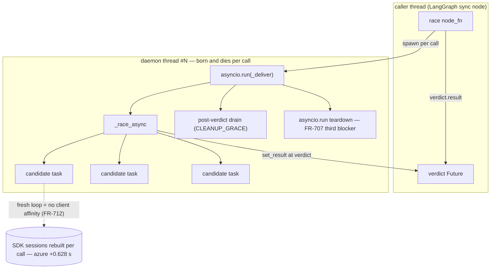
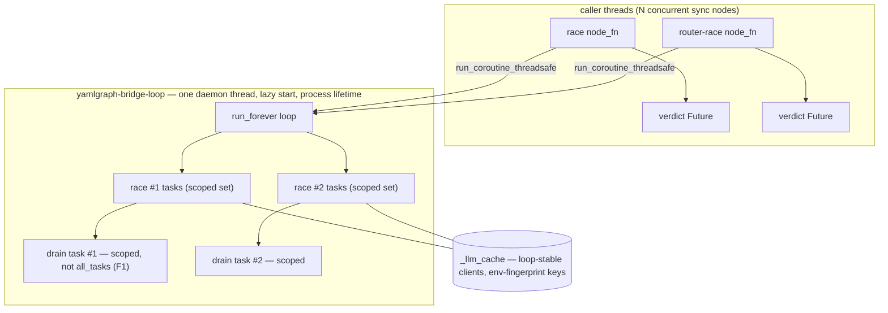

# FR-713: Persistent Bridge Loop — Promote the Event Loop, Not the Node

**Priority:** MEDIUM
**Type:** Enhancement (architecture — substrate promotion)
**Status:** Part A ENFORCED (2026-07-11); Part B JUDGED (2026-07-11) — purity scope frozen (F13–F17), authority granted, gated only on its own RED (AC-12) and witness (AC-14)
**Effort:** 2 days — Part A (persistent loop, PR 1) 1.5 days; Part B (cache re-entry, PR 2, F9) 0.5 days
**Requested:** 2026-07-11
**Spawned by:** Third independent arrival at the same seed — FR-706 seed (generic deadline-aware bridge), FR-707 seed (extract `_run_coro_sync_safe` as primitive), rate-layer reflection 2026-07-10 ("FR-710 candidate"), diary 2026-07-11 (contract-vs-substrate split). This is FR-711's **FR-A**, conjoined with **FR-B** (loop-stable client cache) because the diaries proved neither is sufficient alone.
**Related:** FR-707 (bridge), FR-709 (teardown witness suite), FR-711 (latency instrument), FR-712 (google uncache — potentially supersedable), FR-227 (env-sensitive construction)

## Gate (explicit — do not judge before it opens)

FR-711's frozen verdict rule renders on **deployed** (Instrument 2 / Fly
probe) numbers, executed from the ninchat_voice side (AC-03/04/05, still
pending). This FR is filed now because the local numbers already embed the
mechanism and magnitude; **enforcement authority waits for the deployed
verdict**. If deployed `(B − A) × handshakes-per-turn < 100 ms` → this FR
is Rejected per the frozen rule, no third outcome.

**Gate resolution (2026-07-11, operator decision):** Fly deployment
removed from jurisdiction. With Fly out of scope, the local instrument IS
the operative topology, and the frozen arithmetic renders on local
numbers: azure `(B − A)` = +0.628 s p50 × 2.38 measured races/turn ≈
1.5 s ≫ 100 ms → **CONDEMN → GO**. Independent of latency, the FR-712
correctness class (50% errors on completed cross-loop google calls) and
the unbounded channel rate justify Part A on any deployment. Authority
granted; scope as frozen at judgement.

**Gate history (2026-07-11, NC-366 — fly probe executed):** NC-366
(ninchat_voice `docs/analysis/nc366-fly-probe-2026-07-10.md`) found the
deployed transport Δ **undefined and moot**: google completed 0/59 llm
spans in BOTH arms (pending-forever — azure wins 100% of deployed races),
and the `VERTEX_TRANSPORT` A/B structurally cannot yield the fresh-loop
reconnect delta anyway. Handshakes-per-turn measured: **2.38 mean / 4 max
races per caller turn** (NC-366 AC-01, 42 turns, 100 races). The gate
briefly re-pinned to a deployed azure Arm A/B before the operator
resolved jurisdiction above.

## Summary

Replace the per-invocation daemon-thread + fresh `asyncio.run()` bridge
(`_run_coro_sync_safe`) with **one long-lived event loop thread owned by
the graph runtime**. Race semantics stay at node level — the *same prompt,
N pure LLM candidates* restriction is the invariant that makes cancellation
safe and is not touched. What gets promoted is the substrate.

## Value Statement

Every sync node wrapping async work (race, router-race, and future
map/A2A/copilot async paths) stops paying per-call thread churn and
fresh-loop reconnects; the FR-707 shutdown-blocker class and the FR-712
loop-affinity defect class become unreachable **by construction**.

## Problem (field numbers embedded per FR-711 verdict rule)

The current bridge creates a fresh thread + fresh event loop per race
invocation. Consequences, each with an FR scar:

1. **NC-361 / FR-706/707:** `asyncio.run`'s own teardown waits unboundedly
   on cancellation-ignoring tasks; verdict-first Future handoff +
   `CLEANUP_GRACE` drain was required to unblock the caller. All of it is
   layer-mismatch scar tissue, not race logic.
2. **FR-711/712:** cached google-genai clients **error on ~50% of
   completed calls** crossing fresh loops (`Executor shutdown has been
   called`); fix was uncaching google/vertex — construction per call,
   because loop affinity cannot be honored without a stable loop.
3. **Latency (local instrument, production topology, post-FR-712):**
   fresh-loop reconnect costs **azure Δp50 +0.628 s per call**; google
   +0.067 s (`docs/analysis/fr711-conn-witness-2026-07-10.txt`). The
   reconnect burden is real and per-turn-multiplied by race retries
   (NC-352 doubles handshakes on failure).
4. **Rate layer (2026-07-10 reflection):** FR-708 bounded leak *lifetime*
   (≤ timeout) but nothing bounds *rate* — channels per second under load.
   One persistent loop with cached clients bounds both factors.

The 2026-07-11 diary names the test for correct promotion: **promotion
must delete code**. Loop promotion deletes the bridge; semantic promotion
(racing arbitrary subgraphs) would add a purity contract YAML cannot
express — explicitly out of scope.

## Architectural Overview

### Current topology — fresh loop per invocation

Every invocation pays: thread spawn, loop create, SDK reconnect,
`asyncio.run` teardown. Isolation is the only virtue — a blocked loop
blocks nobody else, and `all_tasks()` sees only its own race.

### Proposed topology — one persistent loop (Part A) + restored cache (Part B)

### Component moves

| Component | Today | After |
|---|---|---|
| Bridge entry | `_run_coro_sync_safe` in race_node.py, underscore-imported by router_race | `yamlgraph/utils/bridge.py` (Layer 3 — imports nothing from Layer 2; `lint-imports` clean), named export |
| Loop lifetime | per call (`asyncio.run`) | process (lazy-started `run_forever` daemon) |
| Verdict transport | Future set inside `_deliver` | `run_coroutine_threadsafe`'s Future, same `verdict_budget` / RuntimeError contract |
| Post-verdict drain | `all_tasks()` on private loop | **scoped task set** per invocation (F1), same CLEANUP_GRACE + WARNING |
| Client cache | `_UNCACHED_PROVIDERS` excludes google/vertex | full cache, gated re-entry (AC-04) |
| Failure domain | one race | **the loop is shared** — sync work on it blocks all races (F6) |

## Proposed Solution

### Part A — persistent bridge loop (FR-711's FR-A)

- One module-level daemon thread running a single long-lived event loop
  (`asyncio.new_event_loop()` + `run_forever`), started lazily on first
  bridge use.
- `_run_coro_sync_safe(coro, verdict_budget)` keeps its **exact
  signature and verdict-first contract**: submit via
  `asyncio.run_coroutine_threadsafe`, wait on the returned Future with
  `verdict_budget`; `RuntimeError` (not `TimeoutError`) on budget breach —
  FR-705's on_error contract preserved unchanged.
- Post-verdict drain (`CLEANUP_GRACE`, abandonment WARNING naming tasks)
  becomes a task **on the persistent loop**, scoped to the invocation's
  own task set (F1) — no `asyncio.run` teardown to fight; the FR-707
  "third blocker" ceases to exist.
- Shutdown: daemon thread only — **no atexit drain** (F7); a hung task can
  never block interpreter exit, and an atexit hook would reintroduce the
  exact shutdown-wait class FR-707 removed.
- Loop-death resilience: bridge entry checks `loop.is_running()`; a dead
  loop thread is restarted lazily with a WARNING (F8).
- Sync-work audit (F6): `create_llm()` construction and the
  `_VERTEX_CONSTRUCT_LOCK` threading lock currently run inside the raced
  coroutine — harmless on a private loop, **head-of-line blocking on a
  shared one**. Construct clients off-loop (caller thread, before submit);
  the vertex lock must never be held on the loop thread.

### Part B — loop-stable client cache (FR-711's FR-B)

**Reframed 2026-07-11 (operator + F13): Part B is a PURITY change, not a
latency change.** `_UNCACHED_PROVIDERS` is provider-special-cased scar
tissue — exactly the class Commandment 8 forbids ("no shims, no compat
flags"). It was justified only while the substrate made loop affinity
unhonorable; Part A removed that justification. Keeping the carve-out now
would be special faulty code living past its cause. The latency prize is
negligible (AC-05 re-run: google Δp50 +0.059 s with per-call
construction); the purity prize is not:

1. **Cache uniformity restored.** Delete the `_UNCACHED_PROVIDERS`
   frozenset, the `cacheable` branch in `_cached_or_create`, and the
   FR-712 scar comment — one caching rule for all providers, zero
   provider carve-outs.
2. **Global-env mutation window collapses from per-call to per-key.**
   Vertex Express construction mutates process-global `os.environ` under
   `_VERTEX_CONSTRUCT_LOCK` + `_masked_env` (FR-227). The lock serializes
   vertex-vs-vertex only; any OTHER thread reading those env vars during
   the masked window races it. Uncached = the window opens on EVERY race
   call, on caller threads (post-F6). Cached = once per cache key per
   process. Same move FR-708 made on leak lifetime: the impurity is
   forced by the SDK's env-reading constructor and cannot be deleted, but
   its exposure collapses by orders of magnitude.

- Keep the **existing** `_llm_cache` (no new registry — FR-711 F-list) but
  clients now live their whole life on one loop, restoring cache
  eligibility for loop-affine SDKs.
- Revert `_UNCACHED_PROVIDERS` for google/vertex **in a separate PR from
  Part A** (F9), only after the FR-712 integration witness (10/10
  fresh-loop completions) is re-derived to the persistent-loop topology
  and passes — the FR-712 instrument-rot lesson: a witness encoding the
  old topology measures a retired world.
- Cache invalidation: env-fingerprint in the key (FR-227 — construction is
  env-sensitive).
- Pre-listed judge hazards (from rate-layer reflection, carried verbatim):
  **fork-safety** (ninchat supervisor forks workers — assert `_llm_cache`
  empty and loop not started pre-fork), shutdown draining, staleness
  semantics.

### Out of scope (purge list)

- Graph-level race semantics (racing subgraphs) — the node-level purity
  restriction is load-bearing; see diary 2026-07-11.
- Async-first `run_graph` migration (sync CLI as thin wrapper) — separate
  seed; this FR only relocates the existing bridge.
- New metrics infrastructure; connection pooling beyond what SDK clients
  already do internally.

## Deletion Ledger (the promotion test)

| Deleted / dissolved | Why |
|---|---|
| Per-call `threading.Thread` + `asyncio.run` in `_run_coro_sync_safe` | one persistent loop |
| `asyncio.run` teardown handling (FR-707 third blocker) | no per-call teardown exists |
| `_UNCACHED_PROVIDERS` google/vertex entries (FR-712) | loop affinity stable — gated on re-derived witness |
| Per-call client construction cost for google/vertex | cache restored |

`CLEANUP_GRACE` and `_BRIDGE_MARGIN` survive (drain bound and verdict
margin are loop-independent invariants).

## Acceptance Criteria

- [x] AC-01 RED: witness assert exactly ONE bridge loop thread across N
      sequential race invocations (currently N threads); thread name
      pinned (`race-bridge` → `yamlgraph-bridge-loop`) —
      `tests/unit/test_fr713_persistent_bridge.py`, RED commit 2e019cd0
- [x] AC-02 FR-709 loser-teardown witness suite green, with its survivor
      assertion **re-derived** to the persistent-loop topology: exactly one
      `yamlgraph-bridge-loop` thread may survive; zero other bridge threads.
      (Judge F4: the original `"race-bridge" in name` check becomes vacuous
      after the rename — "unmodified green" would be instrument rot, the
      FR-712 lesson this FR itself cites.) Warm-up extended: one uncounted
      race warms loop + executor pool before baseline. Live run green
      2026-07-11. Same rot found+fixed in FR-706's thread accounting
      (unlisted by judgement — see diary).
- [x] AC-03 FR-707 verdict-first witnesses green: 0.5 s timeout returns in
      ≤ timeout + margin; drain WARNING still fires for
      cancellation-ignoring coroutine on the persistent loop. (Witness
      itself repaired en route: its caplog assertion only passed via
      test-order propagation pollution — failed in isolation on main.)
- [x] AC-04 SUPERSEDED by the Part B Judgement's frozen set (AC-12–AC-15,
      2026-07-11): the re-derived FR-712 witness lives on as AC-14; the
      F10 descope trigger was narrowed by F13 (purity, not latency, is
      the motivation; the deployed-google incident does not block)
- [x] AC-05 FR-711 instrument re-run on new topology (local jurisdiction
      per gate resolution): Arm-B delta collapsed — anthropic Δp50
      +0.527 → **+0.073 s**, google +0.067 → +0.059 s, both < 100 ms.
      Azure key absent locally (skipped-with-reason per FR-711 F3).
      Numbers: `docs/analysis/fr713-conn-witness-2026-07-11.txt`
- [x] AC-06 Fork-safety by construction: importing yamlgraph does NOT start
      the loop thread; loop starts lazily on first bridge call; AND
      `os.register_at_fork(after_in_child=...)` resets the loop handle (and
      clears `_llm_cache` + re-creates its lock — a forked lock may be held
      by a thread that no longer exists) so a fork after warm-up gets a
      fresh lazy loop in the child (Judge F3)
- [x] AC-07 64+ race tests, router-race tests, FR-708 matrix, FR-710
      floors green: 4859 fast + 105 slow unit tests passed 2026-07-11.
      Two witnesses re-derived, not broken (FR-706 F4 thread accounting,
      FR-707 caplog isolation — both defects pre-existed in the witnesses)
- [x] AC-08 Concurrent-invocation witness: two overlapping race invocations
      on the persistent loop; each post-verdict drain waits on and WARNs
      about ONLY its own invocation's tasks — drain scoped via per-invocation
      task bucket (ContextVar + loop task factory), not `asyncio.all_tasks()`
      (Judge F1)
- [x] AC-09 Abandonment leak bound preserved: on verdict_budget breach the
      bridge cancels the submitted future; witness proves the abandoned
      coroutine is cancelled, not left running — no unbounded-lifetime
      regression of FR-708 (Judge F2)
- [x] AC-10 Shared-loop liveness witness (F6): client construction happens
      on the caller thread — witness asserts create_llm never runs on
      `yamlgraph-bridge-loop`; construction failures are per-candidate
      pre-errors in race accounting, not node failures
- [x] AC-11 Loop-death recovery witness (F8): kill the bridge loop thread,
      then invoke a race — bridge restarts the loop lazily, WARNING fired,
      race completes normally (new production branch requires a witness —
      Commandment 7)
- [x] Changelog fragment in `changelog/unreleased/`; diary entry
      (`diary-2026-07-11-the-witness-that-only-passed-in-company.md`)

## Alternatives Considered

- **Loop-keyed client cache** — rejected in FR-712 F-list: one entry per
  fresh loop = unbounded growth, the week's own disease.
- **Async-first `run_graph`** (delete the bridge entirely) — the better
  end-state but a runtime-wide migration; this FR is the smallest
  sufficient change and is compatible with (a stepping stone toward) it.
- **Keep fresh-loop bridge, pool at HTTP layer** — SDK clients bind
  sessions to loops internally; pooling below the loop cannot fix
  affinity (FR-712 evidence).
- **Do nothing** — azure +0.628 s/call × **2.38 races/turn (measured,
  NC-366)** on a voice fleet is user-audible latency (≈1.5 s/turn
  provisional bound); pending deployed confirmation per gate.

## Judgement (2026-07-11)

Claims verified against code: per-call thread + `asyncio.run` bridge
(`race_node.py:214`), `_UNCACHED_PROVIDERS = {google, vertex}`
(`llm_factory.py:55`), underscore-import coupling
(`router_race_node.py:23`) — all real. Deletion ledger passes the
promotion-must-delete-code test. Purge list sound; Part B correctly
gated on a re-derived witness (AC-04). Alternatives adequately
dismissed with evidence citations.

| # | Finding | Resolution |
|---|---------|------------|
| F1 | Post-verdict drain enumerates `asyncio.all_tasks()` — on a SHARED persistent loop, concurrent invocations drain and WARN about each other's tasks (cross-invocation interference; false abandonment reports) | Drain scoped to the invocation's own spawned tasks; witnessed by AC-08 |
| F2 | Today a budget breach abandons the coroutine and the fresh loop dies with its daemon thread; on a persistent loop the abandoned coroutine runs UNBOUNDED — regresses the FR-708 leak-lifetime bound via the invariant-breach path | Bridge cancels the `run_coroutine_threadsafe` future on abandonment; witnessed by AC-09 |
| F3 | AC-06 guarded lazy start only; fork after first bridge call clones a started-but-dead loop thread into the child — safety depended on consumer discipline | AC-06 amended: `os.register_at_fork` resets loop handle + `_llm_cache` in child |
| F4 | AC-02 demanded FR-709 suite green "unmodified", but the AC-01 thread rename makes its `"race-bridge" in name` survivor assertion vacuous — green by rot, not by guarding | AC-02 amended: survivor assertion re-derived to persistent-loop topology (exactly one loop thread, zero others) |
| F5 | Bridge module promotion (`yamlgraph/utils/bridge.py`) lived only in Related — ambiguous whether in scope | In scope for Part A: the seam moves to a named module; `router_race_node` imports the public name. utils is Layer 3; node_factory importing utils honors import-linter direction |

### Review findings (post-judgement pass, 2026-07-11)

| # | Finding | Resolution |
|---|---------|------------|
| F6 | Sync work on the shared loop: `create_llm()` construction and the `_VERTEX_CONSTRUCT_LOCK` threading lock run inside the raced coroutine — harmless on a private loop, head-of-line blocking for ALL concurrent races on a shared one (a slow vertex construction freezes every race's timeout accounting) | Construct clients off-loop, on the caller thread before submit; vertex lock never held on loop thread. Witnessed by AC-10 |
| F7 | Original draft proposed an atexit drain — contradicts FR-707's own lesson: an atexit hook waiting on cancellation-ignoring tasks reintroduces the unbounded-shutdown-wait class | Dropped. Daemon thread only; abandoned tasks die with the process, the WARNING already names them |
| F8 | Loop thread death (unhandled loop-internal error) permanently breaks every subsequent race — a single point of failure the per-call topology never had | Lazy restart-with-WARNING on `not loop.is_running()` at bridge entry. Witnessed by AC-11 |
| F9 | AC-04's "reverted in the same PR" conflates substrate change (Part A) with cache-policy change (Part B); a failure would be unattributable | Separate PRs; Part B's RED is the re-derived FR-712 witness on the new topology. Effort split in header |

### NC-366 reconciliation (2026-07-11, fly probe landed)

| # | Finding | Resolution |
|---|---------|------------|
| F10 | Deployed google completes ZERO races (0/59 spans, pending-forever, both transports) — Part B's google cache revert presumed a completing google candidate; a local 10/10 witness cannot evidence deployed completions | AC-04 gains a deployed descope trigger: google revert stays out while deployed completions are 0; the google incident is ninchat-side, out of this FR's scope. Note: pending-forever is "different symptom, same organ" as FR-712 loop-affinity — if Part A resolves it, that is a recorded finding, not a claimed objective |
| F11 | Gate quantity was never measurable by Instrument 2 (transport A/B ≠ fresh-loop reconnect Δ) — instrument rot in the gate itself, the same class this FR's F4/AC-02 guard against | Gate re-pinned: deployed azure Instrument-1 Arm A/B × measured 2.38 races/turn; frozen 100 ms line unchanged. Gate remains CLOSED |
| F12 | Handshakes-per-turn estimate (1–3) retired by measurement: mean 2.38, p50 2–3, max 4 — a fifth of turns run FOUR sequential races | Value arithmetic updated in Gate; azure confirmed as sole production cost driver (100% win rate) |

### F13 — Part B reframed on purity (2026-07-11, post-Part-A)

The post-enforcement evaluation asked the wrong question of Part B
("what latency does the revert buy?" — answer: ~60 ms, nearly nothing)
and nearly parked it on that basis, with F10's deployed-google descope as
reinforcement. The operator corrected the frame: **special-cased faulty
code is against the Scripture regardless of its latency cost**
(Commandment 8 — kill entropy, no compat flags; `the_one_law` — the
FR-712 carve-out was a downstream guard whose boundary cause Part A
removed). Two purity findings stand independent of any deployment:

| Impurity | Today (uncached) | After Part B |
|---|---|---|
| Provider carve-out in cache policy (`_UNCACHED_PROVIDERS` + `cacheable` branch) | Permanent special case with retired justification | Deleted — uniform rule |
| Vertex Express `_masked_env` global-`os.environ` mutation window (FR-227) | Opens on EVERY race call, on concurrent caller threads (post-F6) — unguarded against non-vertex env readers | Once per cache key per process |

Consequences for the gates:
- **F10 narrows.** The deployed-google 0-completion descope was a latency
  argument; it does not answer purity. The google/vertex revert proceeds
  on the re-derived FR-712 witness alone (AC-04) — it need not wait for
  the ninchat incident. The witness, not the deployment, is the gate.
- **Part B's value statement is corrected:** deliverable is the deletion
  ledger entry (carve-out gone) and the collapsed env-mutation window;
  any latency change is incidental and shall not be cited as motivation.

**Authority (superseded record):** the original judgement withheld
authority pending FR-711's deployed verdict; the operator resolved
jurisdiction 2026-07-11 (Fly removed from scope, verdict CONDEMN on
local numbers) and Part A was enforced the same day.

## Part B Judgement (2026-07-11)

Scope verified at source: `_UNCACHED_PROVIDERS` + `cacheable` branch
(`llm_factory.py:55,202`), old-policy witnesses
(`tests/unit/test_fr712_uncached_google.py`,
`tests/integration/test_fr712_fresh_loop_completions.py`), REQ-YG-540
text in CAP-03 + ARCHITECTURE. Pre-listed hazards resolved: fork-safety
shipped and witnessed in Part A (`register_at_fork` clears cache with
fresh locks); shutdown draining introduces nothing beyond what every
cached provider already does today; fingerprint-churn cache growth
accepted (no eviction exists today; env churn is rare — recorded, not
engineered around).

| # | Finding | Resolution |
|---|---------|------------|
| F14 | Env-fingerprint scoped to google/vertex would replace one provider carve-out with another — Part B contradicting its own purity frame. Staleness is universal: every cached provider's client survives key rotation today | Fingerprint mechanism is UNIFORM across all providers; the per-provider env-var list is declarative data (one table, like DEFAULT_MODELS), covering the vars each constructor reads (keys, project/location, VERTEX_TRANSPORT, LLM_REQUEST_TIMEOUT) |
| F15 | The FR-712 unit gate asserts the OLD policy (`first is not second` for google/vertex; `_UNCACHED_PROVIDERS` present in source) — it is Part B's natural RED, not an obstacle | Part B's RED = invert those witnesses first: google/vertex assert cache identity; the annotation test dies with the frozenset. Commit RED (SKIP=pytest), then the revert as GREEN |
| F16 | REQ-YG-540's text ("never cached across event loops") becomes false on merge — minting a new REQ would leave a phantom claim standing (growth_as_default) | Rewrite REQ-YG-540 in place (CAP-03 + ARCHITECTURE) to the new contract: loop-stable cached clients on the persistent bridge loop, env-fingerprinted keys, witnessed by identity gate + warm-cached integration run. Same REQ ID — the requirement evolved, the traceability spine holds |
| F17 | Vertex was uncached by same-class inference, never witnessed (FR-712 F4); it re-enters the cache by the same inference — asymmetric evidence either way | Symmetric treatment: google integration witness required (AC-14); vertex rides the inference with skip-with-reason (FR-711 F3 pattern), one line to re-uncache if a field run ever contradicts. The inference annotation moves from the deleted llm_factory comment into the CAP text — the confession travels with the claim |

### Part B Acceptance Criteria (frozen)

- [ ] AC-12 RED: FR-712 unit gate inverted — google/vertex `create_llm`
      twice returns the SAME object (cache identity ⇒ construction once
      ⇒ masked-env window per key, the F13 purity claim, proven
      mechanically); `_UNCACHED_PROVIDERS` absent from llm_factory source
- [ ] AC-13 Uniform staleness gate (F14): changing a fingerprinted env
      var between `create_llm` calls yields a NEW client for any
      provider; unchanged env is a cache hit — parametrized across at
      least google, vertex, anthropic
- [ ] AC-14 Integration witness re-derived: ONE warm CACHED google
      client, 10/10 completed calls on the persistent bridge loop, zero
      errors; vertex skip-with-reason. If it fails: revert stays out,
      Part B ships the fingerprint (AC-13) only, finding recorded
- [ ] AC-15 REQ-YG-540 rewritten in place (F16) in CAP-03 and
      ARCHITECTURE; changelog fragment (req: REQ-YG-540) + diary entry

**Authority:** granted under F13's frame — the PR description and
changelog shall cite entropy removed, not milliseconds. Scope is the
four ACs above; anything further (construction_context seam from the
diary Seed, cache eviction) is out of scope.

## Related

- `yamlgraph/node_factory/race_node.py` (`_run_coro_sync_safe`,
  `CLEANUP_GRACE`, `_BRIDGE_MARGIN`)
- `yamlgraph/node_factory/router_race_node.py` (imports the bridge —
  promote the seam to a named module, e.g. `yamlgraph/utils/bridge.py`,
  ending the underscore-import coupling)
- `yamlgraph/utils/llm_factory.py` (`_llm_cache`, `_UNCACHED_PROVIDERS`)
- Diaries: 2026-07-10 ×4 (witness-that-could-not-hang, runtimes-own-
  shutdown, rate-layer, loser-that-never-got-to-fail, fix-inverted-the-
  question), 2026-07-11 (promote-the-loop-not-the-semantics)
