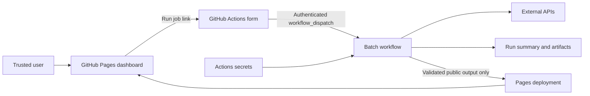

# Plan: a small GitHub-based batch application

**Status:** Architecture plan only; no application has been deployed by this change.
**Decisions recorded:** 2026-09-10.
**Audience:** Personal use or a small trusted team whose operators have repository write access.
**First consumer / first event:** An operator planning a batch tool, before choosing hosting or building a custom trigger service.
**Governing request:** [FR-1037](../feature-requests/FR-1037-github-batch-hosting-plan.md).

## Recommendation and eligibility gate

Start with a static GitHub Pages dashboard that links to GitHub's authenticated
**Run workflow** form. GitHub Actions executes the batch job; GitHub Actions
secrets hold provider credentials. No custom trigger backend is needed initially.

This is a conditional architecture, not a blanket endorsement of Actions as an
application runtime. Before implementation, the operator must identify the actual
workload and verify that it complies with GitHub's terms. Small scale and personal
use alone do not establish eligibility:

- [Actions terms](https://docs.github.com/en/site-policy/github-terms/github-terms-for-additional-products-and-features#actions)
  restrict general serverless application use and unrelated hosted-runner work.
- [Pages limits](https://docs.github.com/en/pages/getting-started-with-github-pages/github-pages-limits)
  exclude commercial SaaS and online-business hosting and warn against sensitive
  transactions.

If the workload does not fit, retain GitHub for source and CI/CD and move execution
to a small cloud job service. Ask GitHub Support if eligibility remains unclear.
The workload has not yet been specified, so this gate remains **open**; merging
this document does not approve deployment, provider spending, or public data release.

## Ideal result

A trusted user can view the latest approved results, request a bounded batch job,
and find its status and output without operating a persistent server or handling
provider credentials. A failed run leaves the last successful result available.

The operator chose a personal/small-team audience and accepted a GitHub UI handoff
for the initial version. Direct triggering from a custom webpage is deferred.

## Architecture

The link opens the workflow page; it does not execute the job. The user signs in,
enters inputs, selects the permitted execution ref, and confirms **Run workflow**
inside GitHub. An existing GitHub login is not authorization for arbitrary Pages
JavaScript to dispatch work. No shared token belongs in the page.

GitHub's [manual-run documentation](https://docs.github.com/en/actions/how-tos/manage-workflow-runs/manually-run-a-workflow)
requires **write access to the repository**. Users without that permission cannot
use this handoff; granting repository access is an operator decision outside this
plan. The workflow must declare `workflow_dispatch` and exist on the default
branch for manual triggering. Do not grant write access merely to avoid building
an appropriately scoped interface for a different audience.

| Component | Responsibility |
|---|---|
| Repository | Source, configuration, tests, workflow definitions |
| Pages | Static dashboard, instructions, last successful results, run/history links |
| Dispatch workflow | Small set of bounded inputs; trusted users and execution refs |
| Reusable batch workflow | Pinned dependencies, validation, execution, result collection |
| Actions secrets | Credentials exposed only to steps needing them |
| Summary and artifacts | Run diagnostics and downloads with explicit access and retention |
| Optional durable ledger | Request identity and external-side-effect recovery |
| Pages deployment | Publish only validated, intentionally public output |

Keep the batch entry point runnable locally as well as in Actions. Use YAMLGraph
when the job needs LLM orchestration; Python tools perform its external side effects.
This document creates no graph, workflow, frontend, secret, or infrastructure.

## Reference: what deviant-daily actually implements

Reference revision:
[deviant-daily 245b7387](https://github.com/sheikkinen/deviant-daily/tree/245b7387a79aba2ce9c7dc9d95025963f44e5e9b).
The inspected sources are its
[README](https://github.com/sheikkinen/deviant-daily/blob/245b7387a79aba2ce9c7dc9d95025963f44e5e9b/README.md)
and
[reusable workflow](https://github.com/sheikkinen/deviant-daily/blob/245b7387a79aba2ce9c7dc9d95025963f44e5e9b/.github/workflows/_pipeline.yml).

- Scheduled and manual triggers call one reusable execution body.
- Provider credentials come from Actions secrets.
- Manual triggering uses GitHub's workflow form, not a custom frontend.
- Inputs are normalized before external side effects.
- A shared concurrency group protects mutable state and rotating credentials.
- A committed publication ledger supports resuming unfinished work.
- Failures remain visible; a post-publication persistence failure requires recovery.

Reuse those patterns, not the product-specific publishing behavior. In particular,
deviant-daily's credential that updates a rotating provider secret is not a general
requirement. Its existence also does not establish hosting-policy eligibility for
a different application. The proposed Pages dashboard is new, not demonstrated
by the reference.

## Security and visibility

- Restrict execution to trusted repository users and approved refs. Do not expose
  production secrets to untrusted pull-request or branch code.
- Start with `contents: read`; grant extra permissions only to the job that needs
  them. Pages publication normally needs `pages: write` and `id-token: write`;
  committing a ledger needs `contents: write`. None requires a browser token.
- Pin dependencies and third-party actions; grant provider credentials only to
  required steps. A pipeline capable of reading a secret can also leak it, so
  log masking alone is not a security boundary.
- Validate inputs as data before spending money or changing external state.
  Never interpolate user input directly into shell source.
- Do not put secrets or sensitive data in dispatch inputs, logs, artifacts, or
  committed results. Define output access and retention before running live work.
- Treat Pages as public unless restricted access has been configured and tested.
  A private repository does not automatically imply a private website. If results
  are private, keep them in access-controlled storage rather than unlisted URLs.
- Do not add a credential with secret-management privileges unless an actual
  provider token-rotation contract requires it.

## Execution, status, and recovery

1. Validate inputs and establish a request identifier before side effects.
2. Enforce job timeouts, bounded retries, and provider usage limits.
3. Record enough state to distinguish unfinished work from completed effects.
4. Produce a readable run summary and downloadable result artifact.
5. Validate and deploy the public result only after successful execution.

The initial dashboard links to GitHub for live run status; it does not claim to
display a live queue. Show the last successful result's timestamp and run link.
An execution failure must not replace that result with partial output.

Only introduce a durable ledger when restarts could duplicate costly or external
effects. A Git-backed ledger can suit tiny, serialized workloads but is not a
general database. Artifacts have retention limits and are not durable application
state. A ledger alone cannot guarantee exactly-once effects: use provider
idempotency keys where available and define manual recovery for ambiguous outcomes.

Use a shared concurrency group for runs that mutate the same ledger or rotating
credential. Choose pending-run behavior explicitly: by default, an older pending
run can be replaced. Current
[concurrency documentation](https://docs.github.com/en/actions/how-tos/write-workflows/choose-when-workflows-run/control-workflow-concurrency)
also describes `queue: max` (up to 100 pending runs), but this is bounded and does
not guarantee dispatch-order execution. Do not present it as a durable job queue.
Avoid cancelling a running job in the middle of an external side effect.

Actions startup and scheduled execution have variable latency. This design is
for asynchronous work, not interactive responses or strict scheduling guarantees.

## Delivery plan

All implementation phases below are **future work**, not acceptance criteria met
by this documentation PR.

| Phase | Deliverable | Completion evidence |
|---|---|---|
| 0. Eligibility | Actual workload, users, data visibility, spending limits | Operator records policy fit and public/private output decision; unclear fit goes to GitHub Support |
| 1. Batch | Local entry point, manual workflow, scoped secrets | One real successful run and downloadable output |
| 2. Dashboard | Pages with Run job, history, timestamped results | User completes webpage → GitHub form → result journey |
| 3. Safeguards | Validation, timeout, concurrency, recovery | Invalid input, overlapping requests, interrupted execution, and failed publication exercised |
| 4. Schedule | Optional scheduled caller of the same workflow | Manual and scheduled paths use the same execution contract |
| 5. Reassess | Direct triggering only if handoff causes demonstrated pain | Named consumer and observed friction justify the extra service |

For a direct custom trigger later, use an authenticated, authorized service with
rate limits and narrow dispatch permission. That service needs its own protected
credential store; it cannot read plaintext credentials back from Actions secrets.
Never embed a shared GitHub token in JavaScript. Recheck hosting eligibility before
turning an operator tool into a public request-driven application.

## Alternatives and research record

Sources were read on 2026-09-10. These are architecture observations, not deployment
tests or legal approval. The operator decisions above select the first option.

| Alternative | Observed basis | Disposition |
|---|---|---|
| Pages → GitHub workflow form | deviant-daily already exposes manual dispatch with typed inputs; Pages is static hosting | Selected conditional MVP: no custom trigger service |
| GitHub workflow form alone | Reference already has this operating surface | Simplest first batch milestone; dashboard adds result discoverability |
| Custom page → authenticated dispatch service | Dispatch is an authenticated API operation; a static page cannot protect a shared credential | Defer until the handoff has demonstrated cost |
| GitHub source/CI → external job service | GitHub terms restrict general serverless use | Required alternative when actual workload is ineligible |

Further sources:
[Pages overview](https://docs.github.com/en/pages/getting-started-with-github-pages/about-github-pages),
[workflow dispatch API](https://docs.github.com/en/rest/actions/workflows#create-a-workflow-dispatch-event),
[Actions billing](https://docs.github.com/en/actions/concepts/billing-and-usage).

Estimate monthly compute as runs per month multiplied by total runner-minutes per
run, including setup and publishing. Account separately for artifact storage and
external API charges. Standard hosted runners in public repositories are free
under current billing rules; private repositories have plan-dependent allowances.
Free billing does not imply permitted use. No measured runtime or cost forecast
exists yet for the unspecified application.
