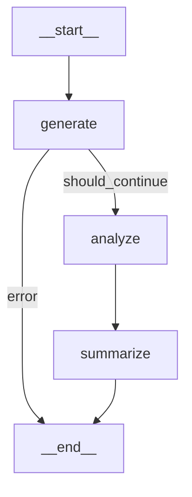
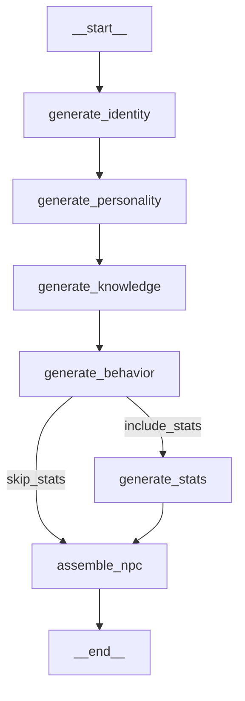
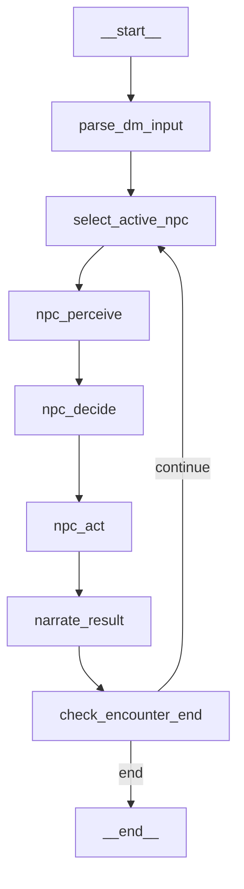

# Porting from Showcase (Python Builder) to Pure YAMLGraph

This document analyzes the `npc/showcase` codebase and plans migration to pure YAML-based graphs.

## Current Architecture Analysis

### Overview

The `npc/showcase` package uses **Python-based graph building** with LangGraph:

```
npc/
├── showcase/
│   ├── builder.py        # build_showcase_graph() - Python StateGraph
│   ├── executor.py       # execute_prompt() - custom LLM executor
│   ├── npc_builder.py    # build_npc_creation_graph() - Python StateGraph
│   ├── models/
│   │   ├── schemas.py    # Pydantic output models
│   │   └── state.py      # ShowcaseState TypedDict
│   └── nodes/
│       ├── content.py    # generate_node, analyze_node, summarize_node
│       ├── npc_nodes.py  # NPC creation nodes
│       └── turn_nodes.py # Encounter turn nodes
├── prompts/
│   ├── generate.yaml
│   ├── analyze.yaml
│   ├── summarize.yaml
│   └── npc/
│       └── *.yaml
└── run.py
```

### Key Patterns in Current Code

#### 1. Graph Building (Python)
```python
# showcase/builder.py
def build_showcase_graph() -> StateGraph:
    graph = StateGraph(ShowcaseState)
    graph.add_node("generate", generate_node)
    graph.add_node("analyze", analyze_node)
    graph.add_node("summarize", summarize_node)
    graph.set_entry_point("generate")
    graph.add_conditional_edges("generate", should_continue, {...})
    graph.add_edge("analyze", "summarize")
    graph.add_edge("summarize", END)
    return graph
```

#### 2. Node Functions (Python)
```python
# showcase/nodes/content.py
def generate_node(state: ShowcaseState) -> dict:
    result = execute_prompt(
        "generate",
        variables={"topic": state["topic"], ...},
        output_model=GeneratedContent,
        temperature=0.8,
    )
    return {"generated": result, "current_step": "generate"}
```

#### 3. State Definition (Python TypedDict)
```python
# showcase/models/state.py
class ShowcaseState(TypedDict, total=False):
    topic: str
    style: str
    word_count: int
    generated: GeneratedContent | None
    analysis: Analysis | None
    final_summary: str | None
    current_step: str
```

#### 4. Pydantic Schemas (Python)
```python
# showcase/models/schemas.py
class GeneratedContent(BaseModel):
    title: str
    content: str
    tags: list[str]
    word_count: int

class Analysis(BaseModel):
    summary: str
    key_points: list[str]
    sentiment: str
    confidence: float
```

---

## Pipelines to Port

### Pipeline 1: Showcase (Content Generation)

**Current flow:**


**Effort:** Low (already exists as `graphs/showcase.yaml`)

### Pipeline 2: NPC Creation

**Current flow:**


**Nodes:** 6 LLM nodes + 1 assembly node
**Effort:** Medium

### Pipeline 3: Encounter Turn

**Current flow:**


**Nodes:** 7 nodes with loop
**Effort:** Medium-High (requires interrupt for DM input)

---

## Migration Strategy

### Phase 1: Showcase Pipeline (Already Done)

The basic showcase pipeline already exists:
- `graphs/showcase.yaml`
- `prompts/generate.yaml`
- `prompts/analyze.yaml`
- `prompts/summarize.yaml`

### Phase 2: NPC Creation Pipeline

#### 2.1 Create Graph: `graphs/npc-creation.yaml`

```yaml
version: "1.0"
name: npc-creation
description: Generate D&D NPC from concept

defaults:
  provider: anthropic
  temperature: 0.7

state:
  # Inputs
  concept: str
  race: str | None
  character_class: str | None
  location: str | None
  role_in_story: str | None
  include_stats: bool

  # Pipeline outputs (inline schemas)
  identity: object
  personality: object
  knowledge: object
  behavior: object
  stats: object | None
  npc: object

nodes:
  generate_identity:
    type: llm
    prompt: npc/create_identity
    state_key: identity
    schema:
      name: str
      race: str
      age: int
      gender: str
      appearance: str
      voice: str
      quirks: list[str]

  generate_personality:
    type: llm
    prompt: npc/create_personality
    state_key: personality
    schema:
      traits: list[str]
      ideals: list[str]
      bonds: list[str]
      flaws: list[str]
      disposition: str
      motivations: list[str]

  generate_knowledge:
    type: llm
    prompt: npc/create_knowledge
    state_key: knowledge
    schema:
      known_facts: list[str]
      secrets: list[str]
      rumors: list[str]
      languages: list[str]

  generate_behavior:
    type: llm
    prompt: npc/create_behavior
    state_key: behavior
    schema:
      combat_style: str
      social_style: str
      reactions: dict[str, str]
      goals: list[str]

  generate_stats:
    type: llm
    prompt: npc/create_stats
    state_key: stats
    schema:
      level: int
      class: str
      strength: int
      dexterity: int
      constitution: int
      intelligence: int
      wisdom: int
      charisma: int
      hit_points: int
      armor_class: int

  assemble_npc:
    type: passthrough
    output:
      npc: |
        {
          "identity": identity,
          "personality": personality,
          "knowledge": knowledge,
          "behavior": behavior,
          "stats": stats
        }

edges:
  - from: START
    to: generate_identity
  - from: generate_identity
    to: generate_personality
  - from: generate_personality
    to: generate_knowledge
  - from: generate_knowledge
    to: generate_behavior
  - from: generate_behavior
    to: generate_stats
    condition: "include_stats == true"
  - from: generate_behavior
    to: assemble_npc
    condition: "include_stats != true"
  - from: generate_stats
    to: assemble_npc
  - from: assemble_npc
    to: END
```

#### 2.2 Copy Prompts

Copy from `npc/prompts/npc/*.yaml` to `prompts/npc/*.yaml`:
- `create_identity.yaml`
- `create_personality.yaml`
- `create_knowledge.yaml`
- `create_behavior.yaml`
- `create_stats.yaml`

#### 2.3 Effort Estimate

| Task | Hours |
|------|-------|
| Create `npc-creation.yaml` | 2 |
| Copy/adapt prompts | 1 |
| Test & validate | 2 |
| **Total** | **5** |

### Phase 3: Encounter Turn Pipeline

This is more complex due to:
1. **Loop structure** - NPCs take turns until encounter ends
2. **DM input** - Requires `type: interrupt` for human input
3. **NPC selection** - Multiple NPCs, need to track active one
4. **World state** - Needs world/location context

#### 3.1 Create Graph: `graphs/encounter-turn.yaml`

```yaml
version: "1.0"
name: encounter-turn
description: Process one round of NPC encounter

state:
  # World context
  world: object
  location: object
  npcs: list[object]

  # Turn state
  active_npc_index: int
  dm_input: str
  perception: object
  decision: object
  action: object
  narration: str
  encounter_ended: bool

nodes:
  get_dm_input:
    type: interrupt
    message: "DM: Describe what happens..."
    state_key: dm_input

  select_npc:
    type: passthrough
    output:
      active_npc: "npcs[active_npc_index]"

  perceive:
    type: llm
    prompt: encounter/perceive
    state_key: perception

  decide:
    type: llm
    prompt: encounter/decide
    state_key: decision

  act:
    type: llm
    prompt: encounter/act
    state_key: action

  narrate:
    type: llm
    prompt: encounter/narrate
    state_key: narration

  check_end:
    type: llm
    prompt: encounter/check_end
    state_key: encounter_ended
    schema:
      ended: bool
      reason: str | None

  next_npc:
    type: passthrough
    output:
      active_npc_index: "(active_npc_index + 1) % len(npcs)"

edges:
  - from: START
    to: get_dm_input
  - from: get_dm_input
    to: select_npc
  - from: select_npc
    to: perceive
  - from: perceive
    to: decide
  - from: decide
    to: act
  - from: act
    to: narrate
  - from: narrate
    to: check_end
  - from: check_end
    to: next_npc
    condition: "encounter_ended != true"
  - from: check_end
    to: END
    condition: "encounter_ended == true"
  - from: next_npc
    to: get_dm_input
```

#### 3.2 Create Prompts

Need new prompts in `prompts/encounter/`:
- `perceive.yaml` - NPC perceives environment
- `decide.yaml` - NPC decides action
- `act.yaml` - NPC takes action
- `narrate.yaml` - Narrate result
- `check_end.yaml` - Check if encounter ends

#### 3.3 Effort Estimate

| Task | Hours |
|------|-------|
| Create `encounter-turn.yaml` | 3 |
| Create prompts (5 files) | 3 |
| Handle loop with interrupt | 2 |
| Test & validate | 3 |
| **Total** | **11** |

---

## Feature Gaps

### Already Supported in YAMLGraph

| Feature | YAMLGraph Equivalent |
|---------|---------------------|
| Python nodes | `type: llm` with prompt |
| Pydantic schemas | `schema:` in node or prompt YAML |
| Conditional edges | `condition: "expr"` |
| State management | `state:` section auto-builds TypedDict |
| Error handling | Built-in `errors` field |
| Retry logic | Built into executor |
| LLM caching | Built into `llm_factory` |

### Requires New Features

| Feature | Status | Notes |
|---------|--------|-------|
| Expression in passthrough | ⚠️ Limited | Need `output:` with expressions |
| Complex conditionals | ✅ Supported | `condition: "a == b and c > d"` |
| Loop (cycle back) | ✅ Supported | Edge can go to earlier node |
| Human interrupt | ✅ Supported | `type: interrupt` |
| Subgraph | ✅ Supported | `type: subgraph` (v0.3.0) |

---

## Recommended Approach

### Step 1: Port NPC Creation (5 hours)

1. Create `graphs/npc/creation.yaml`
2. Copy prompts to `prompts/npc/`
3. Add inline schemas for structured outputs
4. Test with `yamlgraph graph run`

### Step 2: Port Encounter System (11 hours)

1. Create `graphs/npc/encounter.yaml`
2. Create `prompts/encounter/*.yaml`
3. Use interrupt nodes for DM input
4. Test turn loop with persistence

### Step 3: Create CLI Wrapper (2 hours)

Update `yamlgraph` CLI or create wrapper script for NPC-specific commands:

```bash
# Equivalent to: python run.py npc "grumpy dwarf"
yamlgraph graph run graphs/npc/creation.yaml \
  -v 'concept=grumpy dwarf blacksmith'

# Equivalent to: python run.py console
yamlgraph graph run graphs/npc/encounter.yaml --interactive
```

---

## Migration Summary

| Pipeline | Python LOC | YAML Lines | Hours | Priority |
|----------|-----------|------------|-------|----------|
| Showcase | ~200 | ~40 | Done | ✅ |
| NPC Creation | ~250 | ~100 | 5 | High |
| Encounter Turn | ~400 | ~120 | 11 | Medium |
| **Total** | ~850 | ~260 | **16** | |

### Benefits of Migration

1. **No Python code** - Pure YAML configuration
2. **Declarative** - Easier to understand and modify
3. **Testable** - Built-in validation and linting
4. **Portable** - Can run on any YAMLGraph installation
5. **Visualizable** - `yamlgraph graph mermaid` generates diagrams

### Files to Delete After Migration

```
npc/showcase/builder.py
npc/showcase/executor.py
npc/showcase/npc_builder.py
npc/showcase/models/state.py
npc/showcase/nodes/*.py
```

Keep:
```
npc/showcase/models/schemas.py  # Reference for inline schemas
npc/prompts/*                   # Copy to prompts/
```
