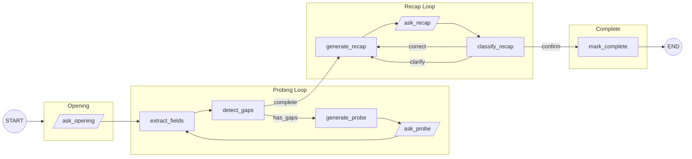
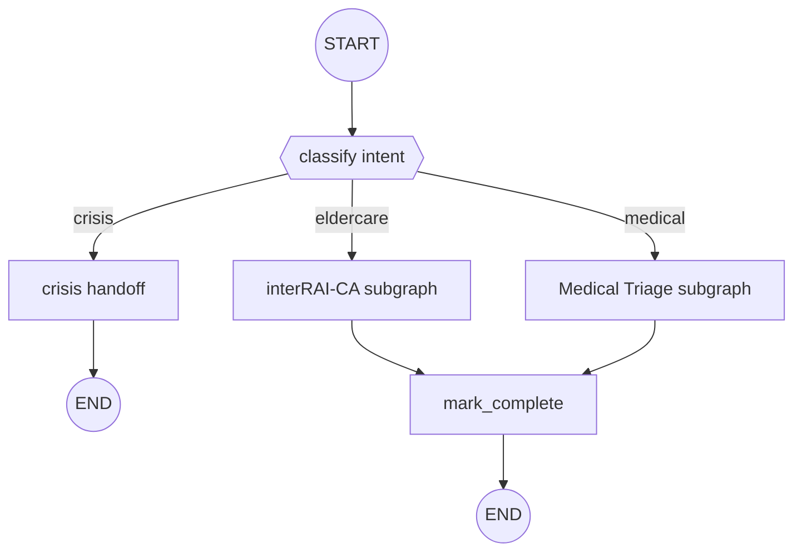

# Probe-Recap Questionnaire Pattern

> **Schema-driven conversational assessments with human-in-the-loop validation — defined entirely in YAML.**

Production-proven architecture for structured data collection through natural conversation. Powers healthcare triage, elderly care assessments (interRAI-CA), depression screening (PHQ-9), and appointment booking across phone, web, and chat channels.

---

## Value Proposition

| Problem | Solution |
|---------|----------|
| Users don't answer in rigid order | LLM extracts fields from free-form conversation |
| Missing data requires follow-up | Schema-driven gap detection drives iterative probing |
| LLM extraction can be wrong | Human-in-the-loop recap confirms before scoring |
| Scoring must be clinically exact | Python algorithms — never delegated to LLM |
| New questionnaires need code | YAML-only: schema + prompts, zero Python per questionnaire |

---

## The Four Phases



| Phase | What Happens |
|-------|-------------|
| **Opening** | LLM greets; interrupt waits for user |
| **Probing** | LLM extracts → Python detects gaps → LLM probes → loop until all required fields collected |
| **Recap** | LLM summarizes → user confirms, corrects, or asks for clarification → loop until confirmed |
| **Complete** | Mark done (optionally score via Python algorithm — sum, AUA decision tree, custom module) |

---

## Three Files Per Questionnaire

```
graphs/my-assessment/
  graph.yaml          # Workflow: nodes, edges, interrupts, loop limits
  schema.yaml         # Fields: types, coded values, display groups
  prompts/
    opening.yaml      # Greeting
    extract.yaml      # Conversation → structured JSON
    probe.yaml        # Follow-up questions for gaps
    recap.yaml        # Human-readable summary
    classify_recap.yaml   # Confirm / correct / clarify
```

No Python required per questionnaire. Shared handlers (gap detection, message management, corrections) live in a reusable service layer.

---

### Schema — What to Collect

From production medical triage (`graphs/medical_triage/schema.yaml`):

```yaml
name: Terveysneuvonnan esitietojen keräys
version: "1.0"
language: fi

fields:
  - id: chief_complaint
    label: Pääasiallinen vaiva
    description: Mikä oire tai vaiva on syynä yhteydenottoon
    required: true
    type: string

  - id: duration
    label: Vaivan kesto
    description: Kuinka kauan vaiva on kestänyt
    required: true
    type: string

  - id: recent_changes
    label: Viimeaikaiset muutokset
    description: Onko vaivassa tapahtunut muutoksia viime aikoina
    required: true
    type: string
```

For coded scales (e.g. interRAI-CA with 21 fields, 6 groups, AUA scoring), add `coding:` maps and `groups:` — see `graphs/interrai_ca/schema.yaml`.

### Graph — How to Orchestrate

From production (`graphs/medical_triage/graph.yaml`), key excerpts:

```yaml
version: "1.0"
name: medical-triage

metadata:
  provider: google
  model: gemini-2.5-flash
  thinking_budget: 0

checkpointer:
  type: memory

loop_limits:
  extract_fields: 10
  generate_probe: 10
  generate_recap: 5
  classify_recap: 5

defaults:
  provider: google
  model: gemini-2.5-flash
  prompts_relative: true
  prompts_dir: prompts

nodes:
  extract_fields:                     # LLM reads conversation → JSON
    type: llm
    prompt: extract
    parse_json: true
    state_key: extracted

  detect_gaps:                        # Python compares extracted vs schema
    type: python
    tool: detect_gaps
    state_key: gaps

  ask_probe:                          # Pause — return question to caller
    type: interrupt
    state_key: response
    resume_key: user_message

  classify_recap:                     # LLM classifies user's recap response
    type: llm
    prompt: classify_recap
    parse_json: true
    state_key: recap_action

edges:
  - from: detect_gaps
    to: generate_probe
    condition: "has_gaps == true"      # Loop while gaps remain
  - from: detect_gaps
    to: set_recap_phase
    condition: "has_gaps == false"     # Exit when complete

  - from: classify_recap
    to: mark_complete
    condition: "recap_action.action_type == 'confirm'"
  - from: classify_recap
    to: apply_corrections
    condition: "recap_action.action_type == 'correct'"
  - from: classify_recap
    to: generate_recap
    condition: "recap_action.action_type == 'clarify'"
```

- **Interrupt nodes** pause execution and return to caller; resume on next user message
- **Conditional edges** drive the probing loop (`has_gaps`) and recap routing (`confirm`/`correct`/`clarify`)
- **Loop limits** prevent infinite cycles (configurable per node)
- **Checkpointer** persists state between turns (memory for voice, Redis for web)

### Prompts — LLM Instructions

Jinja2 templates with full access to schema and state:

```yaml
# extract.yaml — conversation → structured fields
system: |
  Extract field values from the conversation. Return a flat JSON object:
  
  {{ field.id }}: {{ field.description }}
  
  Return null if not available. Preserve prior extractions.

# probe.yaml — follow-up questions for missing fields
system: |
  Ask a follow-up question about the missing fields.
  Be warm and conversational. Group related topics naturally.

# recap.yaml — human-readable summary
system: |
  Summarize collected information conversationally.
  Don't show numeric codes — describe the situation verbally.
  Ask: "Does that sound correct?"

# classify_recap.yaml — confirm / correct / clarify
system: |
  Classify the user's response. Return JSON:
  {action_type: "confirm" | "correct" | "clarify", corrections: {...}}
```

---

## Navigator — Multi-Questionnaire Router

A top-level graph classifies intent and routes to specialized subgraphs:



Production navigator (`graphs/navigator/graph.yaml`) adds emergency triage — crisis detection routes to helpline, health/social emergencies to 112/social services — before dispatching to the appropriate assessment subgraph.

---

## Deployment

| Channel | Stack |
|---------|-------|
| **Phone** | Twilio → ElevenLabs (STT/TTS) → FSM coordinator → YAMLGraph |
| **Web** | HTMX / React → SSE streaming endpoint |
| **Chat** | Ninchat widget → webhook |

**State:** Memory checkpointer for voice (single-process); Redis for web (distributed).
**Observability:** LangSmith traces every LLM call and extraction.
**Cost:** ~€0.85/call at 10k volume.

### Voice Architecture

The phone channel adds an FSM coordinator between Twilio/ElevenLabs and the graph:

```
Caller → Twilio (PSTN) → ElevenLabs (STT/TTS) → FSM Coordinator → YAMLGraph
```

The FSM manages call lifecycle (warm-up, barge-in, farewell) while the graph handles conversation logic. Six coordinator configs support different modes: simple, barge-in, questionnaire, triage, and navigator.

---

## Fit Assessment

| Use Case | Fit |
|----------|-----|
| Clinical assessments (validated instruments) | Excellent |
| Healthcare triage / intake | Excellent |
| Customer onboarding forms | Excellent |
| Surveys with coded scales | Excellent |
| Appointment booking with confirmation | Good |
| Open-ended interviews (no fixed schema) | Poor — use agent pattern |

---

## Further Reading

- [Graph YAML Reference](graph-yaml.md) — Node types, edges, conditions
- [Prompt YAML Reference](prompt-yaml.md) — Jinja2 templates, schemas
- [Interrupt Nodes](interrupt-nodes.md) — Human-in-the-loop mechanics
- [Subgraph Nodes](subgraph-nodes.md) — Graph composition
- [Checkpointers](checkpointers.md) — State persistence
- [Common Patterns](patterns.md) — Router, loop, agent patterns

Last reviewed: 2026-05-03
