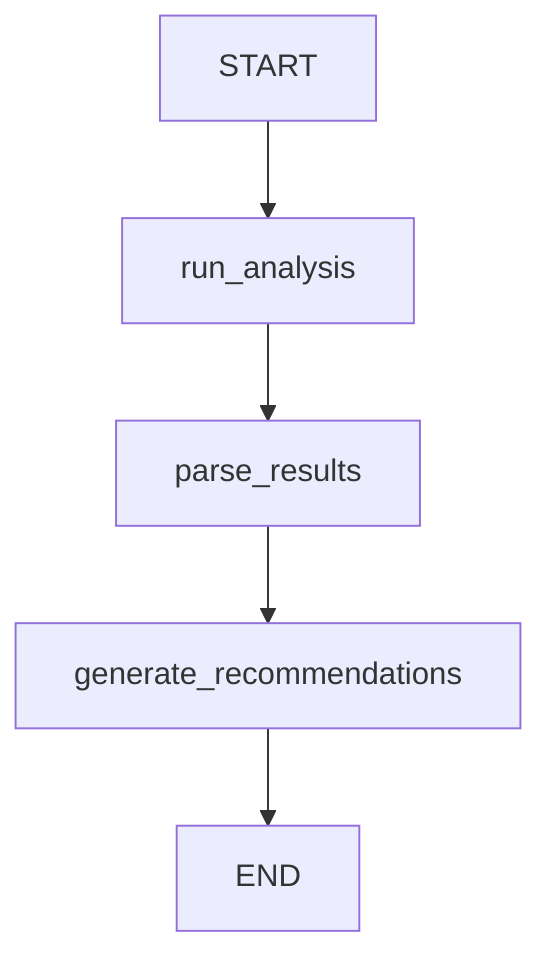

# Code Analysis Tool

A yamlgraph pipeline that runs code analysis tools and generates actionable recommendations using LLM.

## Overview

This graph automates the code analysis workflow by:
1. Running analysis tools (ruff, pytest, radon, bandit, vulture, mypy)
2. Parsing the results into structured data
3. Using an LLM to generate prioritized recommendations

## Architecture



## Tools Used

| Tool | Purpose | Output |
|------|---------|--------|
| `ruff` | Linting | Violations list |
| `pytest --cov` | Tests + coverage | Pass/fail, coverage % |
| `radon cc` | Cyclomatic complexity | Functions with complexity > 5 |
| `bandit` | Security scan | Vulnerability findings |
| `vulture` | Dead code detection | Unused code list |
| `mypy` | Type checking | Type errors |

## Graph Design

### `graphs/code-analysis.yaml`

```yaml
version: "1.0"
name: code-analysis
description: Run code analysis and generate improvement recommendations

tools:
  run_ruff:
    type: shell
    command: ruff check {path} --output-format=json 2>/dev/null || echo "[]"
    description: "Run ruff linter and return JSON results"
    parse: json

  run_tests:
    type: shell
    command: python -m pytest {path} -q --tb=no --cov={package} --cov-report=json 2>/dev/null; cat coverage.json 2>/dev/null || echo "{}"
    description: "Run tests with coverage"
    parse: json

  run_radon:
    type: shell
    command: radon cc {path} -j 2>/dev/null || echo "{}"
    description: "Run cyclomatic complexity analysis"
    parse: json

  run_bandit:
    type: shell
    command: bandit -r {path} -f json -ll 2>/dev/null || echo '{"results":[]}'
    description: "Run security scan"
    parse: json

  run_vulture:
    type: shell
    command: vulture {path} --min-confidence 80 2>/dev/null || echo ""
    description: "Detect dead code"
    parse: text

  run_mypy:
    type: shell
    command: mypy {path} --ignore-missing-imports --no-error-summary 2>&1 || echo ""
    description: "Run type checking"
    parse: text

nodes:
  run_analysis:
    type: agent
    prompt: code-analysis/analyzer
    tools: [run_ruff, run_tests, run_radon, run_bandit, run_vulture, run_mypy]
    max_iterations: 10
    state_key: analysis_results

  generate_recommendations:
    type: llm
    prompt: code-analysis/recommend
    requires: [analysis_results]
    state_key: recommendations
    variables:
      path: "{state.path}"
      package: "{state.package}"
      analysis: "{state.analysis_results}"

edges:
  - from: START
    to: run_analysis
  - from: run_analysis
    to: generate_recommendations
  - from: generate_recommendations
    to: END
```

## Prompts

### `prompts/code-analysis/analyzer.yaml`

```yaml
system: |
  You are a code quality analyst. Use the available tools to analyze the codebase
  and gather comprehensive quality metrics.

  Run the following analyses in order:
  1. run_ruff - Check for linting issues
  2. run_tests - Get test results and coverage
  3. run_radon - Check code complexity
  4. run_bandit - Scan for security issues
  5. run_vulture - Find dead code
  6. run_mypy - Check type annotations

  Collect and summarize all results.

user: |
  Analyze the codebase at path: {path}
  Package name: {package}

  Run all analysis tools and compile the results.
```

### `prompts/code-analysis/recommend.yaml`

```yaml
system: |
  You are a senior software engineer providing code quality recommendations.
  Based on the analysis results, generate prioritized improvement suggestions.

  Format your recommendations as:
  1. **Critical** - Must fix (security issues, failing tests)
  2. **High Priority** - Should fix soon (high complexity, type errors)
  3. **Medium Priority** - Improve when possible (dead code, linting)
  4. **Low Priority** - Nice to have (style, minor improvements)

  For each recommendation, include:
  - The specific issue
  - The file/location
  - A concrete fix suggestion
  - Estimated effort (quick fix / moderate / significant)

user: |
  Codebase: {path}
  Package: {package}

  Analysis Results:
  {analysis}

  Generate a prioritized list of recommendations to improve code quality.
```

## Usage

```bash
# Run analysis on yamlgraph package
yamlgraph graph run graphs/code-analysis.yaml \
  --var path="yamlgraph" \
  --var package="yamlgraph"

# Run on a specific directory
yamlgraph graph run graphs/code-analysis.yaml \
  --var path="src/myapp" \
  --var package="myapp"
```

## Output Example

The graph produces a structured recommendations report:

```markdown
# Code Quality Recommendations for yamlgraph

## Critical (0 issues)
No critical issues found.

## High Priority (2 issues)

### 1. High cyclomatic complexity in graph_loader.py
- **File**: yamlgraph/graph_loader.py
- **Function**: `compile_graph` (complexity: 12)
- **Fix**: Extract edge processing into separate function
- **Effort**: Moderate

### 2. Type errors in executor.py
- **File**: yamlgraph/executor.py:45
- **Issue**: Argument 1 has incompatible type
- **Fix**: Add proper type annotation for return value
- **Effort**: Quick fix

## Medium Priority (5 issues)
...
```

## Integration with CI

Add to `.github/workflows/analysis.yml`:

```yaml
- name: Run Code Analysis
  run: |
    pip install yamlgraph[dev]
    yamlgraph graph run graphs/code-analysis.yaml \
      --var path="src" \
      --var package="mypackage" \
      > analysis-report.md

- name: Upload Analysis Report
  uses: actions/upload-artifact@v3
  with:
    name: analysis-report
    path: analysis-report.md
```

## Implementation Status

- [ ] Create `graphs/code-analysis.yaml`
- [ ] Create `prompts/code-analysis/analyzer.yaml`
- [ ] Create `prompts/code-analysis/recommend.yaml`
- [ ] Add integration tests
- [ ] Add to demo.sh script
